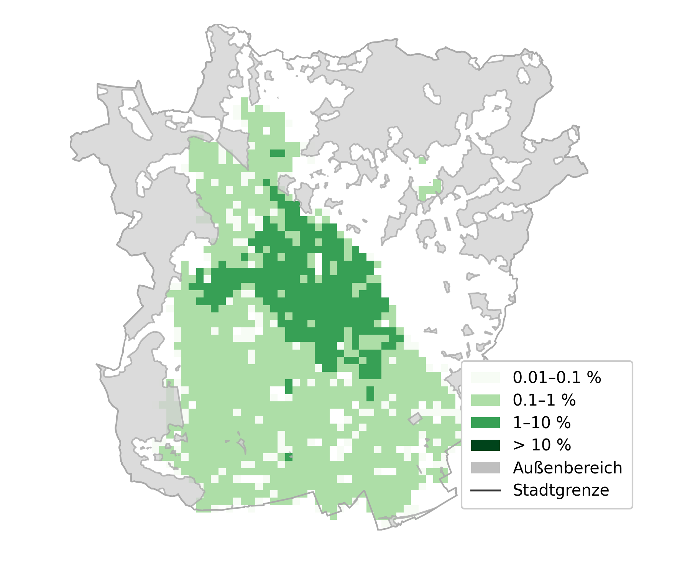
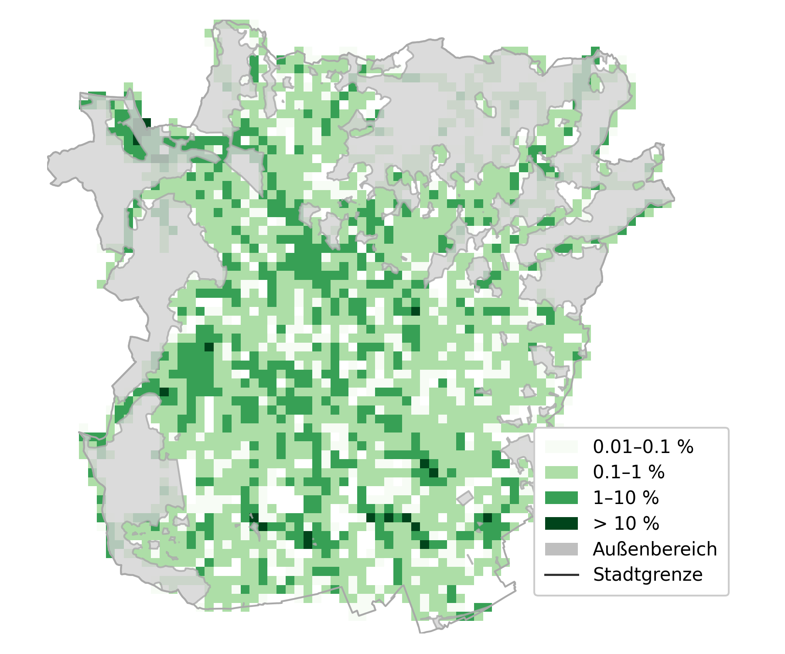
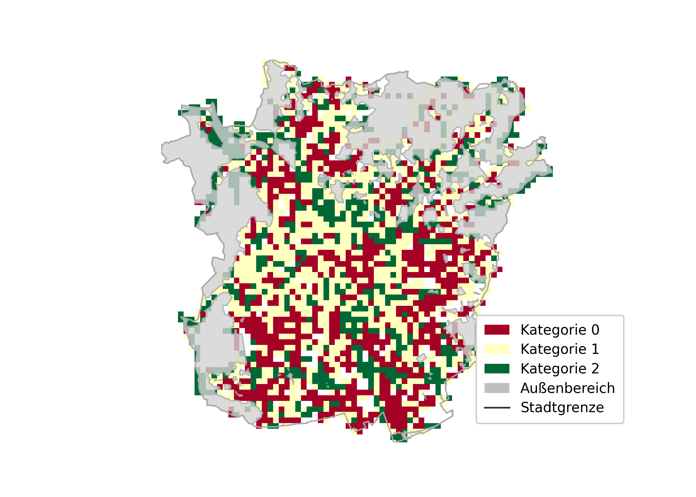

# Maßnahmenkarten für Blau-Grüne Infrastruktur in Graz

!!! abstract 
    Der Bericht bewertet das öffentliche Flächenpotenzial für drei Maßnahmen der naturnahen Regenwasserbewirtschaftung in Graz – entsiegelbare Parkplätze, Retentionsmulden und Baumrigolen – und quantifiziert ein konservatives Gesamtrückhaltepotenzial von rund 180.000 m³ im Mischkanalisationsgebiet. Während Mulden und Baumrigolen substanzielle Retentionsvolumina bieten, tragen entsiegelbare Parkplätze vor allem zur Reduktion versiegelter Flächen bei. Die Potenziale konzentrieren sich im Stadtkern und entlang bewirtschafteter Verkehrsflächen. Je nach Bemessungsstrategie können zwischen 20 % (Starkregenvorsorge) und über 40 % (Jahresmittel-Entkopplung) der relevanten Flächen wirksam entwickelt werden. Insgesamt zeigt die Analyse, dass Graz über erhebliche, bislang ungenutzte Kapazitäten verfügt, um Kanalisation, Wasserbilanz und Starkregenvorsorge durch blau-grüne Infrastruktur nachhaltig zu verbessern. --- [Bericht](assets\doku_bgi_oeffentlich.pdf)

Das Arbeitspaket 4 des Projekts dNWB untersucht das räumliche Potenzial zur Umsetzung naturnaher Regenwasserbewirtschaftungsmaßnahmen im Stadtgebiet von Graz. Ziel ist es, Maßnahmenkarten für drei zentrale Typen der blau-grünen Infrastruktur zu erstellen und deren mögliche Wirkung im Kontext von Starkregenvorsorge und Entlastung der Mischkanalisation einzuschätzen:

* Entsiegelbare Parkplätze
* Sicker- und Retentionsmulden im Straßenbegleitgrün
* Baumrigolen

Der Schwerpunkt liegt auf Flächen **im öffentlichen Besitz**, da hier unmittelbare Handlungsspielräume bestehen. Insgesamt umfasst Graz etwa **12.700 ha**, wovon rund **1.050 ha** öffentliches Gut darstellen. Das Mischwasserkanalnetz bewirtschaftet ca. **6.600 ha**, darunter etwa **710 ha** öffentliche Flächen.

Die drei Maßnahmen adressieren unterschiedliche räumliche Situationen und Funktionsbereiche:

* Parkflächen → hohes Potenzial zur Reduktion versiegelter Oberflächen
* Straßenbegleitgrün → dezentrale Retention entlang von Verkehrswegen
* Baumrigolen → Kombination aus Retention und klimaaktiver Begrünung im dichten Stadtraum

---

## Ergebnisse

Die folgende Zusammenfassung gibt die **Gesamtpotenziale** für das Stadtgebiet und insbesondere das **Mischkanalisationsgebiet** wieder. Die Werte geben **untere Grenze – Mittelwert – obere Grenze** an (Tab. 8, S. 9–10) .

### Gesamtpotenziale im Mischgebiet

| Maßnahme                         | Fläche [ha]  | Rückhaltevolumen               |
| -------------------------------- | ------------ | ------------------------------ |
| **Entsiegelbare Parkplätze**     | 39 – 48 – 55 | –                              |
| **Mulden im Straßenbegleitgrün** | 55 – 56 – 57 | 137.500 – 140.000 – 142.500 m³ |
| **Baumrigolen**                  | 32 – 43 – 56 | 64.000 – 84.000 – 112.000 m³   |

→ **Summiertes potenzielles Retentionsvolumen im Mischgebiet: ~224.000 m³**
→ Konservativ anzusetzen: **ca. 180.000 m³** (80 % der berechneten Werte)

---

### Entsiegelbare Parkplätze

* Gesamtes Potenzial: **41–61 ha**, Mittelwert **~48 ha**
* Starke Konzentration im **Stadtkern** und in bewirtschafteten Parkzonen
* **Keine** Potenziale im **Osten** (schlechte Sickerfähigkeit & hohes Gefälle)
* Verteilung nach Verschmutzungsklassen (ÖWAV RB 45):

  * **F2:** ~8 ha (17 %)
  * **F3:** ~40 ha (83 %)
  * Flächen > F3 treten im Datensatz nicht auf
* Sickerfähige Gestaltung ist v. a. auf **F2- und F3-Flächen** möglich

---

### Sicker- und Retentionsmulden im Straßenbegleitgrün

* Potenzial: **89–93 ha**, Mittelwert **~91 ha**
* Über das gesamte Stadtgebiet verteilt
* Häufig lineare, zusammenhängende Strukturen im öffentlichen Raum
* Bieten ein großes dezentrales Retentionspotenzial (Ø 0,25 m Tiefe → ~140.000 m³)

---

### Baumrigolen

* Potenzialfläche: **39–70 ha**, Mittelwert **~52 ha**
* Rückhaltekapazität (Standardrigole, 0,2 m): **64.000–112.000 m³**
* Starke Häufung im **Stadtkern** und entlang von Rad-/Gehwegen & Parkflächen
* Viele geeignete Standorte durch räumliche Nähe von Geh-/Radwegen zu Parkplätzen
* Mindestbreite und Abstand zu Gebäuden sind die entscheidenden Einschränkungen

---

### Bewertung der Potenziale

Die Analyse zeigt, dass das Retentionspotenzial je nach Bemessungsstrategie stark variiert:

* **Auf 30-jährliche Bemessung (Starkregenvorsorge)** ausgelegt →
  → vollständige Rückhaltung von **~98 %** aller Ereignisse bei **A_EZG = 3,6 km²**

* **Auf 0,5-jährige Bemessung (Jahreswasserbilanz)** ausgelegt →
  → Bewirtschaftung von **18 km²** möglich, aber nur **~74 %** vollständige Rückhaltung

Räumlich ergibt sich (Abb. 9, S. 14) :

* **20 %** der Fläche erreichen **Retentionsziel 2** (30a-Strategie)
* **42 %** erreichen **Retentionsziel 1** (0.5a-Strategie)
* **38 %** besitzen Potenzial, aber nicht ausreichend für Ziel 1
* **~1 %** ohne identifizierbares Potenzial

---

## Diskussion

Die Überlagerung der drei Maßnahmen zeigt:

* **Baumrigolen & entsiegelte Stellplätze schließen sich nicht aus.**
  Eine entsiegelte Parkplatzfläche kann über einer Rigole liegen.
* **Baumrigolen vs. Mulden:**
  Nur **1,4 ha (1,5 %)** der Muldenflächen überschneiden sich mit Rigolen → vernachlässigbar.
  → **Potenziale können addiert werden.**

Weitere wichtige Punkte:

* **Bereits bestehende Maßnahmen** wurden nicht aus dem Potenzial herausgerechnet.
  Das tatsächliche Potenzial dürfte daher **etwas geringer** ausfallen.
* Die **retentionshydrologische Wirkung** wurde konservativ bewertet:

  * keine Berücksichtigung der **Entleerung während des Ereignisses**
  * Abflussbeiwert der öffentlichen Flächen im Vergleich **konservativ mit 1.0** angesetzt
* Das tatsächliche Rückhaltepotenzial ist daher **tendenziell höher** als berechnet.

### Gesamtinterpretation

* Das **Retentionsziel 1** (Jahresmittel-Entkopplung) kann auf **ca. 60 % der Siedlungsfläche** erreicht werden.
* Das **Retentionsziel 2** (30-jährliche Ereignisse) ist flächendeckend **nicht erreichbar** – v. a. wegen räumlicher Ungleichverteilung der Potenziale.
* Für großflächige Starkregenvorsorge müssen weitere Maßnahmen ergänzt werden (z. B. Rückhaltebecken, Dachbegrünungen, Entsiegelungen außerhalb des Ö-Guts).
