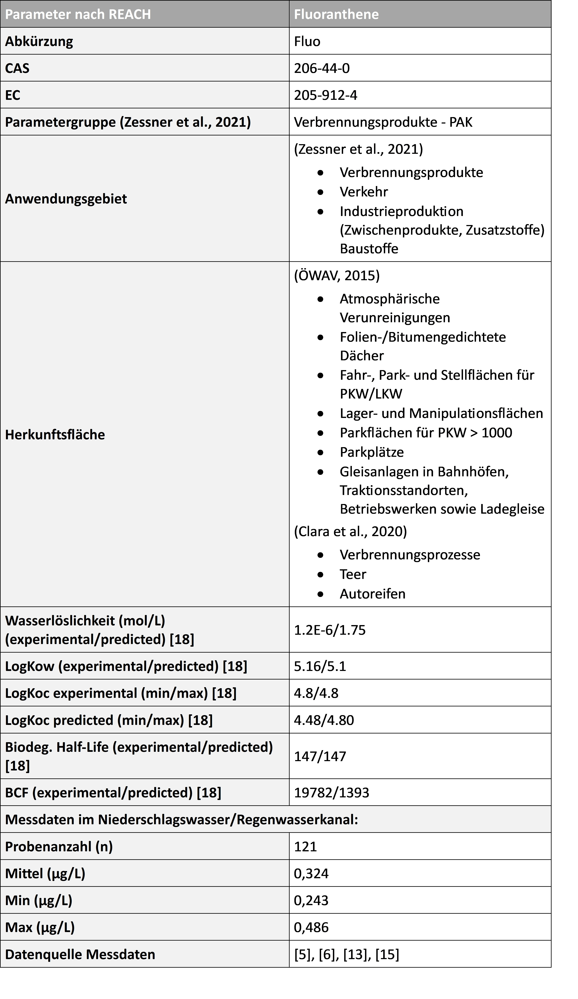
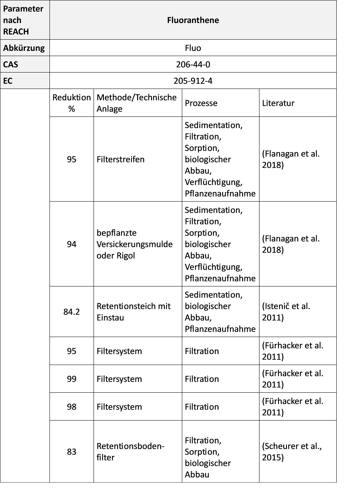

!!! abstract 

    Bei der Planung und Bemessung dezentraler Niederschlagswasserbewirtschaftungssysteme ist neben der hydraulischen Leistungsfähigkeit auch die stoffliche Belastung des Niederschlagswassers zu berücksichtigen. Die Kenntnis relevanter Schadstoffe, ihrer Herkunft sowie ihres Verhaltens in den unterschiedlichen Systemen bildet die Grundlage für einen wirksamen Gewässer- und Grundwasserschutz.

## Zielsetzung
Die Wasserqualität ist ein wesentlicher Aspekt der dezentralen Niederschlagswasserbewirtschaftung. Durch atmosphärische Deposition sowie den Kontakt mit unterschiedlichen Oberflächen können Schadstoffe in das Niederschlagswasser eingetragen werden und Auswirkungen auf Vegetation, Boden, Grundwasser und Oberflächengewässer haben. 

Ziel dieser Seite ist es, einen Überblick über relevante Stoffgruppen im Niederschlagswasser zu geben, deren Umweltrelevanz darzustellen und die Bedeutung dezentraler Niederschlagswasserbewirtschaftungssysteme (dNWB) für den Stoffrückhalt zu erläutern.

Die Auswahl der relevanten Stoffe basiert auf einer Literaturrecherche und den Ergebnissen des SIWAWI-Projekts[^1]. Für den Eintragspfad Niederschlagswasser wurden insgesamt 61 relevante Parameter identifiziert. Nach projektspezifischer Eingrenzung wurden 53 Parameter weiter betrachtet. Für jeden Stoff wurden zwei Stoffsteckbriefe erstellt. Der erste Steckbrief enthält Informationen zu Anwendungsgebiet, möglichen Herkunftsflächen sowie relevanten chemischen und physikalischen Eigenschaften. Der zweite Steckbrief behandelt den Rückhalt des jeweiligen Stoffes in dezentralen Niederschlagswasserbewirtschaftungssystemen (dNWB) und fasst die Ergebnisse der Literaturrecherche zusammen.

[^1]: [Zukünftige stoffliche und mikrobiologische Herausforderungen für die kommunale Siedlungswasserwirtschaft](https://www.bmluk.gv.at/service/publikationen/wasser/zukuenftige-stoffliche-und-mikrobiologische-herausforderungen-fuer-die-kommunale-siedlungswasserwirtschaft.html)

Die detaillierten Stoffsteckbriefe sind im Projektbericht dokumentiert. Auf dieser Seite wird exemplarisch der Stoffsteckbrief von Fluoranthene dargestellt, um den Aufbau und den Inhalt der Steckbriefe zu veranschaulichen. Für die vollständige Beschreibung und Bewertung der weiteren Stoffe wird auf den Projektbericht verwiesen.

## Relevante Stoffgruppen
Die identifizierten Stoffe lassen sich folgenden Gruppen zuordnen:
* Metalle
* Biozide
* Industriechemikalien
* Kosmetikinhaltsstoffe
* Nichtmetallische Ionen
* Polyzyklische aromatische Kohlenwasserstoffe (PAK)

Die Herkunft der Stoffe ist abhängig von den angeschlossenen Flächen. Typische Quellen sind Verkehrsflächen, Dächer, Fassaden, Industrie- und Gewerbeflächen sowie atmosphärische Einträge. 

Die Umweltrelevanz, Mobilität, Abbaubarkeit, Bioakkumulation sowie das Rückhaltepotenzial in dezentralen Niederschlagswasserbewirtschaftungssystemen können innerhalb einer Stoffgruppe erheblich variieren. Daher ist jeder Stoff anhand seiner spezifischen chemischen und physikalischen Eigenschaften sowie seines Eintragspfades gesondert zu betrachten und zu beurteilen.

## Bewertung von Stoffen
Zur Beurteilung des Verhaltens eines Stoffes in dNWB-Systemen werden insbesondere folgende Eigenschaften herangezogen:
* Wasserlöslichkeit
* Adsorbierbarkeit: Verteilungskoeffizienten (Log KOW (auch unter Log POW bekannt), Log KOC)
* Abbaubarkeit: Halbwertszeit DT50 
* Biokonzentrationsfaktor – Bioakkumulation (BCF)

Diese Eigenschaften ermöglichen Aussagen über:
* Mobilität im Boden
* Rückhalt im Substrat
* Verlagerung ins Grundwasser
* Anreicherung in Organismen
* Langfristige Umweltrelevanz

## Begriffsdefinitionen

**KOW; Log KOW:** „Der dimensionslose n-Octanol-Wasser-Verteilungskoeffizient (KOW) ist ein Maß für das Verhältnis von Fettlöslichkeit und Wasserlöslichkeit eines Stoffes und wird meist in Form des dekadischen Logarithmus Log KOW angegeben.“ (Zessner et al., 2022)[^1]

**KOC; Log KOC:** „Die Verteilung eines Stoffes zwischen organischem Kohlenstoff im Boden und Wasser wird wiederum durch den dimensionslosen KOC oder in Form des dekadischen Logarithmus Log KOC angegeben. Er beschreibt die Affinität eines Stoffes, sich an Partikel zu binden.“ (Zessner et al., 2022)[^1]

**DT50:** „Der DT50 Wert beschreibt die Zeit (in Tagen) für den Abbau eines Stoffes, zu der 50 % der ursprünglichen Menge eines Stoffes abgebaut sind.“ (Zessner et al., 2022)[^1]

**BAF; BCF:** „Der Bioakkumulationsfaktor BAF gibt das Verhältnis der Konzentration eines Stoffes im Organismus zu der Konzentration des Stoffes in der umgebenden Matrix an.

BAF = CStoff (Organismus) / CStoff (Umgebung)

Der Bioakkumulationsfaktor BAF ist somit der Quotient zweier Konzentrationen. Ist die umgebende Matrix Wasser, dann wird er als Biokonzentrationsfaktor BCF bezeichnet:

BCF = CStoff (Organismus) / CStoff (Wasser)“ (BG BAU, 2023)[^2]

[^2]: [BG BAU Berufsgenossenschaft der Bauwirtschaft - Biokonzentrationsfaktor BCF](https://www.bgbau.de/themen/sicherheit-und-gesundheit/gefahrstoffe/sicherheitsdatenblatt/biokonzentrationsfaktor-bcf)

Für die Beurteilung der Umweltrelevanz und des Verhaltens von Stoffen stehen verschiedene nationale und internationale Bewertungsansätze zur Verfügung, darunter die REACH-Verordnung der Europäischen Union oder Kriterien der U.S. Environmental Protection Agency (EPA). Diese Systeme ermöglichen eine Einordnung hinsichtlich Persistenz, Bioakkumulationspotenzial, Mobilität und Gewässergefährdung. Eine detaillierte Beschreibung der einzelnen Bewertungsansätze und Schwellenwerte ist im Projektbericht enthalten. Nach der Europäischen Union (2008)[^3] können zum Beispiel Stoffe als gewässergefährdend mit chronischer Wirkung eingestuft werden, wenn sie nicht schnell abbaubar sind und/oder ein experimentell bestimmter Biokonzentrationsfaktor (BCF) ≥ 500 vorliegt oder falls kein BCF verfügbar ist ein Log KOW ≥ 4 erreicht wird.

[^3]: [Richtlinie 2008/105/EG des europäischen Parlaments und des Rates vom 16. Dezember 2008 über Umweltqualitätsnormen im Bereich der Wasserpolitik und zur Änderung und anschließenden Aufhebung der Richtlinien des Rates 82/176/EWG, 83/513/EWG, 84/156/EWG, 84/491/EWG und 86/280/EWG sowie zur Änderung der Richtlinie 2000/60/EG, Fassung vom 21.10.2019](https://eur-lex.europa.eu/legal-content/DE/ALL/?uri=CELEX%3A32008L0105)

## Beispiel Steckbrief Fluoranthene:

Tabelle 1: Anwendungsgebiete, Herkunftsflächen, chemische und physikalische Eigenschaften und Messdaten.  
{ width="60%" }

Tabelle 2: Literaturergebnisse zum Stoffrückhalt in dNWBs.  
{ width="60%" }

## Stoffliche Belastung von Dachwässern
Der Leitfaden vom Amt der Oberösterreicherischen Landesregierung „zur Verbringung von Niederschlagswässern von Dachflächen und befestigten Flächen“[^4] besagt, dass Dächer mit bituminösen Dichtungsbahnen keine messbaren Emissionen von PAKs mehr aufweisen. Der Grund dafür ist, dass nur noch bitumengebundene Dichtungsbahnen verwendet werden. Auch Dächer mit Foliendichtungen weisen bezüglich Pestizide oder anderen relevanten Additive meistens keine messbaren Emissionen auf. Bei Dächern die unbeschichtet und metallgedeckt sind, weist das Dachwasser hinsichtlich Zink und Kupfer erhöhte Werte auf und muss ab einer Dachflächengröße von 200 m² vorgereinigt werden.

[^4]: [Leitfaden zur Verbringung von Niederschlagswässern von Dachflächen und befestigten Flächen](https://www.land-oberoesterreich.gv.at/files/publikationen/ww_Leitfaden_Verbringung_von_Niederschlagswaessern.pdf)

Ein weiterer Stoff dem hinsichtlich Dachwässer Aufmerksamkeit geschenkt werden soll ist Mecoprop (Eggen, 2009 [^5]; Burkhardt, 2017 [^6]). Mecoprop ist der Wirkstoff von wurzelfesten Bitumenbahnen die bei Flachdächern ihre Anwendung finden und wird durch Hydrolyse aus dem im Bitumen enthaltenen Ester freigesetzt. Dabei konnte beobachtet werden, dass vor allem beim Materialschutzmittel Preventol B2 (Glykolester von Mecoprop), aufgrund dessen schlechten Auswaschverhalten, hohe Belastungen stattfinden. Die Dachwasserentlastung kann bis um das 20-fache reduziert werden, wenn Preventol B2 zum Beispiel mit 2-Ethylhexlyester von Herbitect oder Preventol B5 ersetzt wird. Das schweizer Bundesamt für Umwelt (BAFU) empfiehlt Bitumenbahnen mit Durchwurzelungsschutzmittel nur auf Gründächern anzuwenden und generell sollte im Fundamentbereich und auf begrünten Tiefgaragendächern auf eine Anwendung verzichtet werden. (EAWAG, 2009)[^7]

[^5]: [ EAWAG News - Anthropogene Spurenstoffe im Wasser Effekte − Risiken − Massnahmen](https://library.eawag.ch/eawag-publications/EAWAGnews/67D(2009).pdf)
[^6]: [Wurzelfeste Bitumenbahnen: Test- und Beurteilungsverfahren für die Auswaschung](https://www.ost.ch/fileadmin/dateiliste/3_forschung_dienstleistung/institute/umtec/projekte/wasser_und_abwassertechnik/bafu_mecoprop_bitumenbahnen/171220_bafu-information_mecoprop_in_bitumen-dachbahnen_bafu_final.pdf)
[^7]: [Mecoprop in Bitumenbahnen - Auswaschung von Mecoprop aus Bitumenbahnen und Vorkommen im Regenkanal (DOI: 10.13140/RG.2.1.3294.0649)](https://www.researchgate.net/publication/268577857_Mecoprop_in_Bitumenbahnen_Auswaschung_von_Mecoprop_aus_Bitumenbahnen_und_Vorkommen_im_Regenkanal)

## Bereits eingesetzte/zukünftige Substrate der Stadt Graz
Bei dem parallel laufenden Projekt von Land schafft Wasser wurden Säulenversuche beauftragt, bei denen nach ÖNORM B 2506-3 unter anderem der Rückhalt von Blei, Kupfer und Zink untersucht wird. Soll das Substrat auch als Grundwasserschutz dienen, wäre es empfehlenswert den Schadstoffrückhalt von den Parametern der QZV Chemie GW zu untersuchen. Die Liste mit den 61 Parametern deckt sich diesbezüglich mit folgenden Parametern: Blei, Cadmium, Chrom, Kupfer, Nickel, Quecksilber und PAK. In einem noch unveröffentlichten Bericht (Allabashi et al., 2022)[^8] wurden, bezüglich Schadstoffrückhalt im Substrat, folgende Parameter untersucht: Blei, Cadmium, Chrom, Kupfer, Nickel, elektrische Leitfähigkeit, Ammonium, Nitrat, Chlorid, Sulfat, Phosphat, Summe PAKs, KW-Index. Da die Richtlinien zur Einhaltung von Grenzwerten bestimmter Spurenstoffe in der Zukunft bestimmt strenger werden und auch die Parameterlisten angepasst werden, ist es empfehlenswert, dass die eingesetzten Substrate in dNWBs auf mehr als nur die Parameter nach ÖNORM B 2506-3 untersucht werden.

[^8]: [Straßen Abwasserlösungen für Vegetation und Entwässerung SAVE - unveröffentlicht](https://forschung.boku.ac.at/de/publications/152905)

!!! info
    
    Für weitere Informationen siehe Bericht [Naturnahe Regenwasserbewirtschaftung 4.0 - Handlungsempfehlungen für Graz und die Steiermark - Zwischenbericht](...)

    Ansprechpartner: [TU Graz - Institut für Siedlungswasserwirtschaft und Landschaftswasserbau](https://www.tugraz.at/institute/sww/home)
