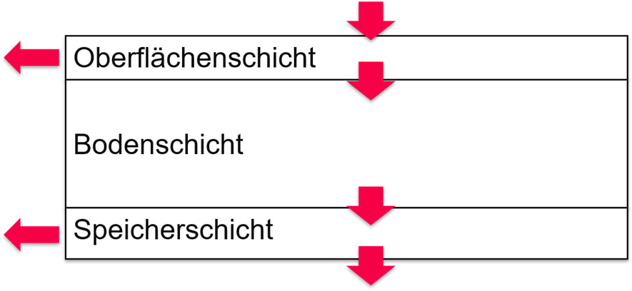
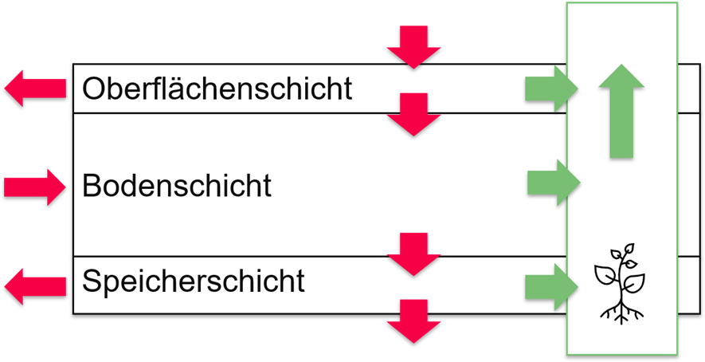

# Wasserwirtschaftliche Grundlagen – Hydraulik und Hydrologie

!!! abstract 
    Die wasserwirtschaftlichen Grundlagen ausgewählter dezentraler Niederschlagswasserbewirtschaftungssysteme (dNWBs) sowie die maßgebenden Zusammenhänge zwischen Randbedingungen, Prozessen und relevanten Systemparametern wurden auf Basis einer umfassenden Literaturrecherche erarbeitet. Die hydrologischen und hydraulischen Grundlagen wurden zusammengefasst und bestehende vereinfachte Modellansätze analysiert, deren Erweiterungsbedarf bewertet sowie deren Weiterentwicklung dokumentiert. Zur Ergänzung begrenzter Messdaten wurden detaillierte Modellierungen von JRAquaconsol herangezogen. Die erarbeiteten vereinfachten Modellansätze dienen als Grundlage für die Beschreibung und Bewertung der untersuchten dNWBs.

## Ermittlung der physikalischen Vorgänge
Durch einen hohen Versiegelungsgrad verliert der urbane Wasserkreislauf seinen natürlichen Charakter. Dezentrale Niederschlagswasserbewirtschaftungsmaßnahmen (dNWBs) sollen nun einspringen, um den urbanen Wasserkreislauf mit reduziertem Platzbedarf zurück zum natürlichen Zustand zu führen. Hierfür sollen dNWBs folgende Aufgaben übernehmen:

* Versickerung
* Verdunstung (Evapotranspiration)

Als Versickerungsflächen sollen DNWBs den Anteil des versickernden Niederschlagswassers erhöhen. Hierdurch werden kommunale Entwässerungssystem entlastet und pluviale Überflutungen abgeschwächt. Als Verdunstungsflächen sollen dNWBs den Anteil des evapotranspirierenden Niederschlagswassers erhöhen. Hierdurch werden Hitzeinseln bekämpft und die hydraulische Belastung auf Gewässer reduziert. Beide Funktionen verzögern und reduzieren die Ableitung in empfangende Oberflächengewässer.

Im Kontext der Stadtbegrünung dienen dNWBs vorrangig der ausreichenden Bewässerung des Bewuchses sowie dem Schutz vor Staunässe.

Um dNWBs hinsichtlich ihrer Eignung bezüglich ihres Wasserrückhaltes auszulegen, ist es notwendig, den Transport von Wasser in der Maßnahme vorhersagen zu können.

## Sichtung angewendeter Vereinfachungen

Es wurden Modelle zur Simulation von Grüner Infrastruktur von verschiedenen Herstellern betrachtet (z.B. DHI, Sieker, EPA, ITWH). Das am weitesten angewendete vereinfachte Modell zur Simulation von dNWBs ist der 3-Schichten-Ansatz aus EPA-SWMM (EPA, 2018). Der in SWMM verwendete 3-Schichten-Ansatz gliedert grüne Infrastrukturmaßnahmen in eine Oberfläche, eine Bodenschicht und eine Speicherschicht (siehe Abbildung 5 1) (Rossman & Huber, 2016).

{ width="60%" }

Abbildung 5 1:	3-Schichten Modell aus EPA SWMM nach Rossman & Huber (2016)

Die Oberflächenschicht erlaubt den Einstau von zufließendem Niederschlagswasser und interagiert mit der darunterliegenden Bodenschicht durch Infiltration. Die Perkolationsgeschwindigkeit innerhalb der Bodenschicht wird mithilfe der Green and Ampt Methode ermittelt. Ist die Sättigungsfront bis zur Speicherschicht vorgeschritten, wird der Transport von Wasser in die Speicherschicht mit Darcy’s Gesetz ermittelt. Zur Berücksichtigung der Evapotranspiration wird in der Massenbilanz in allen 3 Schichten ein pauschaler Wert angesetzt (Rossman & Huber, 2016).

## Identifikation von Schwachstellen
Um genauere Aussagen hinsichtlich der Leistung Grüner Infrastruktur und insbesondere ihrer Wechselwirkung mit der Begrünung treffen zu können, reicht der bestehende 3-Schichten-Ansatz nicht aus. Besonders die verwendete Methode zur Berücksichtigung der Evapotranspiration ist unzureichend, um die Wasserbilanz sinnvoll zu schließen.

Eine wichtige Aufgabe der dNWBs ist die Retention von Niederschlagswasser im Regenwetterfall. Eine funktionale Anforderung an dezentrale Entwässerung ist es hierbei, Oberflächenabfluss schadenfrei abzuleiten. Hierfür ist vor allem die Frage von Bedeutung, wie schnell und wie viel Oberflächenabfluss in der dNWB versickern kann. Diese Frage lässt sich gut mit dem bestehenden Ansatz beantworten.

Über die Frage, wie sich das zurückgehaltene Wasser längerfristig in der dNWB verhält, kann der bestehende 3-Schichten-Ansatz jedoch nur ungenaue Antworten geben. Um aber den Bewässerungsbedarf und die zu erwartende Evapotranspirationsleistung der dNWBs vorhersagen zu können, sind genau diese längerfristigen Phänomene von Bedeutung.

## Adaption des gewählten Modells
Zur Verbesserung der Vorhersagequalität der Evapotranspirationsleistungen wurde in den letzten Jahren versucht, SWMM weiterzuentwickeln. Hörnschemeyer et al. (2021) schlagen dabei die Einführung eines zusätzlichen Vegetationslayers zu den drei bestehenden Layern vor (siehe Abbildung 5 2). Für diesen Vegetationslayer werden Interzeptionsverluste, Transpiration und Evaporation am offenen Boden berechnet und über einen Schattierungsfaktor angepasst.

{ width="60%" }

Abbildung 5 2:	Adaptierter 3-Schichten-Ansatz, nach Hörnschemeyer et al. (2021)

Im Ansatz von Hörnschemeyer et al. (2021) wird der Evapotranspirationsansatz verbessert, unter anderem indem er abhängig vom Bodenwassergehalt der Bodenschicht berechnet wird. SWMM verwendet die Green and Ampt Methode zur Berechnung des Transportes von Wasser in der Bodenschicht. Da dieser Ansatz ursprünglich entwickelt wurde, um den kurzfristigen Wassertransport im eingestauten Zustand zu berechnen, ist die Eignung für den längerfristigen Rückhalt von Wasser in der ungesättigten Bodenzone zu prüfen und gegebenenfalls durch einen anderen Ansatz zu ersetzen.

## Validierung des Modellansatzes
Die Validierung erweiterter Modellansätze erfordert die Übertragung auf konkrete Maßnahmen, wofür Pläne und Konstruktionsdetails bereits umgesetzter Maßnahmen notwendig sind. Vorhandene Monitoringdaten werden dabei zur Validierung des vorhergesagten Verhaltens herangezogen. So wurde der Ansatz beispielsweise auf das Reallabor Leonhardgürtel übertragen. Für Maßnahmen, für die durch JRAquaConSol detaillierte und kalibrierte Modelle erstellt wurden, wurden synthetische Messdaten ergänzend herangezogen.

!!! info
    Für weitere Informationen siehe Bericht [Naturnahe Regenwasserbewirtschaftung 4.0 - Handlungsempfehlungen für Grau und die Steiermark - Zwischenbericht](...)

    Ansprechpartner: [TU Graz - Institut für Siedlungswasserwirtschaft und Landschaftswasserbau](https://www.tugraz.at/institute/sww/home)
