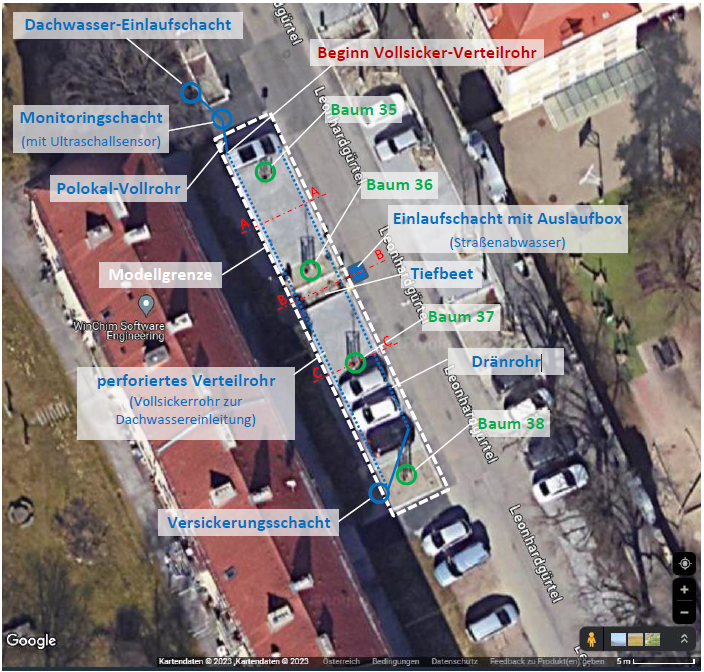
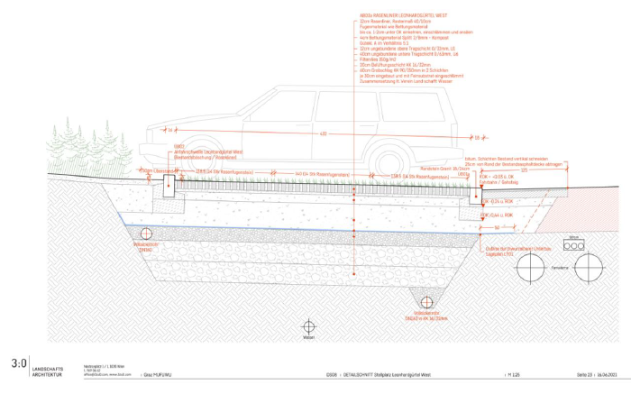
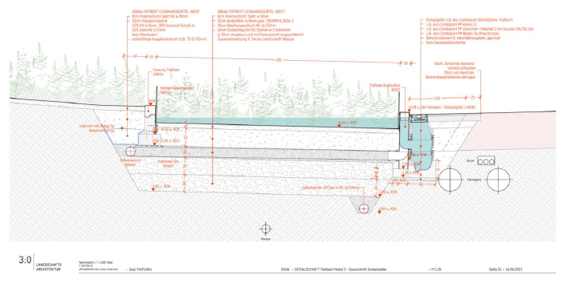
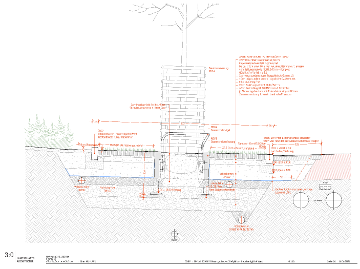
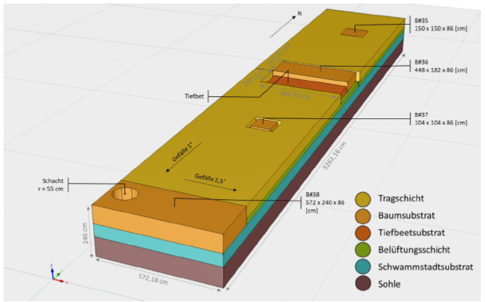

!!! abstract
    
    Der folgende Beitrag bezieht sich auf Erkenntnisse, die im Rahmen des Projektes dNWB erarbeitet wurden.

    Simulationsmodelle ermöglichen es, komplexe hydrologische Prozesse in urbanen Infrastruktursystemen mathematisch abzubilden und dadurch ein besseres Prozessverständnis zu gewinnen. Im Bereich der Regenwasserbewirtschaftung werden modellbasierte Ansätze zunehmend eingesetzt, um das Verhalten von Schwammstadt- und Baumstandortsystemen zu analysieren und deren hydraulische und hydrologische Funktionsweise zu bewerten.

    Im vorliegenden Abschnitt wird das Schwammstadtsystem am Standort Leonhardgürtel in Graz modellhaft untersucht. Aufbauend auf dem ursprünglichen Konzept der sogenannten „Stockholmsysteme“ (Embrén & Alvem, 2017) sowie dessen Adaption für österreichische Anwendungen (Zeiser et al., 2023) wird ein dreidimensionaler Modellansatz verwendet, um die wesentlichen Prozesse der Wassereinleitung, -verteilung und -versickerung im System nachzubilden. Aufgrund der komplexen Geometrie und der heterogenen Substratstruktur kommt dafür das numerische Simulationsmodell HYDRUS-3D zum Einsatz, das Wasserbewegungen in variabel gesättigten porösen Medien auf Basis der Richards-Gleichung beschreibt.

    Die Modellkalibration erfolgt anhand von Messdaten aus Bodenfeuchtesensoren sowie Beobachtungen aus Flutungsversuchen. Die Simulationsergebnisse zeigen, dass die Wassereinleitung aus dem Dachwasserschacht hauptsächlich im nördlichen Abschnitt des Systems erfolgt und sich das Wasser über die Belüftungs- bzw. Verteilschicht horizontal gut über die gesamte Breite des Systems ausbreitet. Gleichzeitig führt der gut durchlässige Untergrund zu relativ kurzen Retentionszeiten im Schwammstadtsubstrat. Die Modellierung liefert damit wichtige Erkenntnisse über die hydrologische Funktionsweise des Systems und unterstützt das Verständnis der Wasserverteilung innerhalb komplex aufgebauter Schwammstadtstrukturen.

### Allgemeiner modellhafter Ansatz

Modellhafter Ansatz von Baumstandorten der Regenwasserbewirtschaftung

Kurze Zusammenfassung der Herkunft der Idee (Embrén & Alvem,
Britt-Marie, 2017), der Österreichischen Adaption (Zeiser et al., 2023).

### Detaillierte modellbasierte Abbildung eines Stockholmsystems

Zur Entwicklung eines besseren Verständnisses der Vorgänge im Inneren des Stockholmsystems, wurde das Schwammstadtsystem am Standort Leonhardgürtel in einem Computermodell nachgebildet. Da es sich um ein sehr komplexes System handelt, war die Umsetzbarkeit der ursprünglich geplanten Ziele mit einer gewissen Unsicherheit behaftet. Ursprünglich vorgesehen waren neben der modellhaften Nachbildung der wesentlichen Prozesse auch Szenarienrechnungen für unterschiedliche Standorte und Substrate. Im Zuge der Bearbeitung wurde der Umfang auf die modellhafte Nachbildung der wesentlichen Prozesse des Systems Leonhardgürtel für ausgewählte Flutungsversuche reduziert.

#### Modellgebiet
Abbildung 1 zeigt eine schematische Darstellung des Modellgebiets „Schwammstadtsystem Leonhardgürtel“. Ausgewählte Querschnitte des Schwammstadtsystems sind in Abbildung 2, Abbildung 3 und Abbildung 4 dargestellt. Abbildung 5 zeigt ein Foto des schlussendlichen (oberflächlichen) Aussehens des Stadtbaumsystems am Leonhardgürtel mit dem Tiefbeet und den Bäumen (Baum 38 nicht sichtbar).

Abbildung 1: Schematische Darstellung des Modellgebiets "Schwammstadtsystem Leonhardgürtel"

Abbildung 2: Schnitt A-A „Querschnitt durch das Schwammstadtsystem“ (Lage siehe Abbildung 1); übernommen von 3:0 Landschaftsarchitektur

Abbildung 3: Schnitt B:B „Querschnitt durch das Tiefbeet“ (Lage siehe Abbildung 1); übernommen von 3:0 Landschaftsarchitektur

Abbildung 4: Schnitt C-C „Querschnitt durch das Schwammstadtsystem im Bereich der Baumscheibe“ (Lage siehe Abbildung 1); übernommen von 3:0 Landschaftsarchitektur

#### Modellgeometrie
Informationen zur Geometrie des Schwammstadtsystems „Leonhardgürtel“ standen in Form von Plänen sowie auch in Form von einer Fotodokumentation für den Zeitraum der Bauphase zur Verfügung. Darüber hinaus wurden auch noch eigene Untersuchungen vor Ort durchgeführt. Der untersuchte und modellierte Bereich erstreckt sich von Norden nach Süden mit einer Länge von 32,6 m, einer Breite von 5,7 m (Ost-West) und einer Tiefe von 2,4 m (Abbildung 5). An der Oberfläche sind folgende Komponenten des Systems erkennbar: Baumsubstrat, Versickerungsschacht und Tiefbeet. Die 4 Bäume sind von Norden nach Süden mit aufsteigenden Nummern benannt (Baum #35, Baum #36, Baum #37, Baum #38). In Ost-West-Richtung stehen die Bäume in der Mitte des Modells, in Nord-Süd-Richtung sind sie ca. 8 m voneinander entfernt. Am südwestlichen Rand des Modells befindet sich der Versickerungsschacht, in den das Wasser aus dem Vollsicker- und Dränrohr abgeleitet wird. Abbildung 10 zeigt das Tiefbeet an einem Regentag (29.8.2022), in welchem das Regenwasser der angrenzenden Straße gesammelt und über das Tiefbeetsubstrat in das Schwammstadtsystem versickert wird.

Abbildung 5: Geometrie und Schichtaufbau des Modelles

#### Zusammenfassung
Schwammstadtsysteme werden in der (Siedlungs-)Wasserwirtschaft bzw. – verbunden mit der Pflanzung von Bäumen – auch in der Stadtplanung vermehrt eingesetzt. Die Kombination mehrerer Funktionen ohne den Platzbedarf dabei zu erhöhen, macht einerseits vor allem im städtischen Raum enorm Sinn. Andererseits macht diese Multifunktionalität die Systeme jedoch relativ komplex in ihrem Aufbau und im Zusammenwirken der unterschiedlichen Funktionen, sodass in diesem Bereich noch Forschungsbedarf besteht. Im hydrologischen Sinn betrifft das vor allem die Funktionsweise der Wasserverteilung innerhalb des Schwammstadtsystems. Mit Hilfe von numerischen Simulationsmodellen ist es möglich, solche Systeme mathematisch nachzubilden und die generelle hydrologische und hydraulische Funktionsweise sowie die steuernden Prozesse und Zusammenhänge abzuleiten.

Das wesentliche Ziel ist die modellhafte Nachbildung der wesentlichen Prozesse des Schwammstadtsystems am Standort Leonhardgürtel, um somit ein besseres Systemverständnis zu erlangen. Dieses Schwammstadtsystem ist an der Oberfläche als Parkplatz in Kombination mit Stadtbäumen ausgebaut. Aus diesem Grund befinden sich in diesem System auch vier Baumscheiben, die mit einem mit Pflanzenkohle gemischten Substrat gefüllt sind. Zusätzlich gibt es auch ein Tiefbeet-Versickerungsbecken, das zur Einleitung von Straßenabwasser gedacht ist. Das zentrale Element aus hydrologischer Sicht ist jedoch der Schwammstadtkörper im Untergrund, der als Wasserretentionsraum bzw. auch für die Wasserversorgung der Stadtbäume dienen soll. Über dem Schwammstadtsubstrat befindet sich noch eine Belüftungsschicht aus Schotter ohne Feinanteil zur Versorgung mit Luftsauerstoff. In dieser Schicht ist auch ein Verteilrohr zur Einleitung von Dachwasser eingebaut, sodass diese Schicht auch als Verteilschicht für das Einleitungswasser fungiert.

Aufgrund der vorliegenden Heterogenität und des komplexen Aufbaus des Schwammstadtsystems am Standort Leonhardgürtel ist für diesen Anwendungsfall ein dreidimensionaler Modellansatz erforderlich. Unter Anbetracht dieser Tatsache sowie aufgrund der Erfordernis, alle relevanten hydrologischen und hydraulischen Funktionen und Prozesse modellhaft abzubilden, wurde für diese Anwendung das Modell HYDUS-3D ausgewählt. 3D-Hydrus ist ein Softwarepaket zur Simulation von Wasser-, Wärme- und Stofftransport in dreidimensionalen porösen Medien mit variabler Sättigung und basiert auf der Richards-Gleichung. Die für die Modellierung erforderlichen Boden- bzw. Substratparameter wurden dabei einerseits aus Laboranalysen bzw. In-situ-Messungen, andererseits aus Literaturangaben abgeleitet und bei Bedarf im Zuge der Modellkalibration noch entsprechend adaptiert.

Die Modellkalibration wurde anhand von Messdaten im Schwammstadtsubstrat eingebauter Bodenfeuchtesensoren sowie visueller Beobachtungen der Versickerungsstrecke des eingeleiteten Wassers im Verteilrohr des Flutungsversuchs vom 19.4.2023 durchgeführt. (Anmerkung: Die Flutungsversuche wurden in einem gesonderten Untersuchungsrahmen durchgeführt). Eine genaue Modellkalibration war nicht möglich, da die Ausgabe der Sensormessungen im Schwammstadtsubstrat mit gewissen Unsicherheiten behaftet ist. Daher wurden weniger die absoluten Wassergehaltswerte, sondern vielmehr die Dynamik – also die Zeitpunkte der Sensorreaktion – für die Kalibration herangezogen. Auch die Länge der Versicherungstrecke ist durch Blatt- und Astablagerungen insofern beeinflusst worden, als es dadurch zu einem gewissen Wasserrückstau und einer Verminderung der Wasserausbreitung im Verteilrohr während der Flutungsversuche gekommen ist. Nichts desto trotz geben diese Messungen und Beobachtungen wesentliche Anhaltspunkte, um das Modell in dessen hydrologischer und hydraulischer Parametrisierung zu verbessern und die Plausibilität der Ergebnisse zu prüfen.

Entgegen der ursprünglich geplanten Vorhaben, dass mit dem Simulationsmodell auch Prozesse wie Wurzelaufnahme, Evapotranspiration oder infiltrierender Niederschlag mitberücksichtigt werden, zeigten die ersten Ergebnisse, dass andere Prozesse wie z.B. die Dach-/Straßenabwassereinleitung oder die Versickerung in den Untergrund um Größenordnungen relevanter sind als die Verdunstung oder der Niederschlag auf die Parkplätze. Aus diesem Grund sowie aufgrund der bereits bestehenden hohen Komplexität und des erheblichen Rechenaufwands der Simulationen wurde der Schwerpunkt auf die Prozesse Wassereinleitung, Wasserausbreitung im Untergrund und Wasserausleitung aus dem Schwammstadtsystem gelegt.

Die Ergebnisse zeigen eine gute Übereinstimmung in der Dynamik der Wassergehalte, wobei Wassergehaltsänderungen – sowohl in den Feldmessungen als auch in den Simulationen – ausschließlich im nördlichen Bereich in der Nähe des Wassereinleitungspunktes auftreten. Das bedeutet, dass die Wassereinleitung aus dem Dachwasserschacht nicht über die ganze Länge des Schwammstadtsystems, sondern eher konzentriert auf den ersten Metern des Verteilrohres stattfindet. Die aus den Flutungsversuchen sowie aus den Modellrechnungen ermittelten Versickerungsstrecken im Verteilrohr betragen ca. 15-17 m. Wie aus den Modellrechnungen hervorgeht, kommt es durch die Belüftungs-/Verteilschicht zu einer guten horizontalen Wasserausbreitung über die gesamte Breite des Systems. Ausgenommen sind davon lediglich die Baumscheiben, die aus einem eigenen Baumsubstrat mit unterschiedlichen physikalischer und chemischer Zusammensetzung aufgebaut sind und die vom Wasser generell umströmt werden. Im Bereich des Wassereinleitungspunktes sowie auf den ersten Metern des Verteilrohres kommt es auch verstärkt zu einer vertikalen Versickerung in das darunterliegende Schwammstadtsubstrat. Aufgrund eines gut durchlässigen Ausgangsbodens, auf dem das Schwammstadtsubstrat aufliegt, ist die Retentionszeit des Wassers im Schwammstadtsubstrat relativ gering, was sowohl durch die Flutungsversuche, als auch durch die Modellsimulationen gezeigt und bestätigt wurde.

!!! info
    Für weitere Informationen siehe Bericht [MPGB Projekt NWB 4.0 Fa. AquaConSol - Modellhafte Nachbildung der Flutungsversuche am Standort Leonhardgürtel & Bestimmung des Schadstoffrückhalts (Säulenlaborversuche)](...)

    Ansprechpartner: [JR AquaConSol](https://www.jr-aquaconsol.at/)