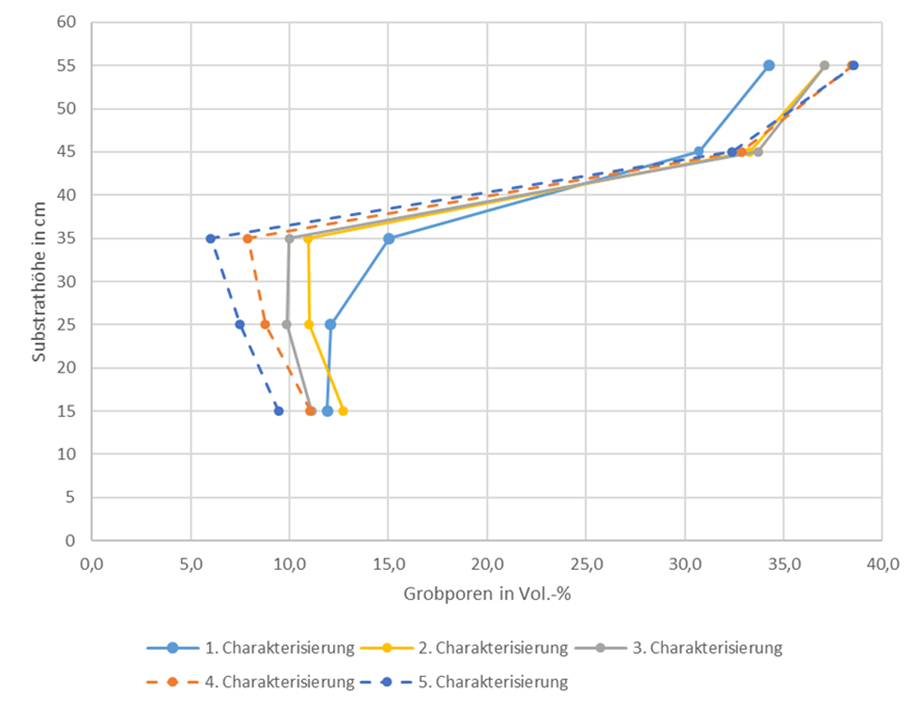
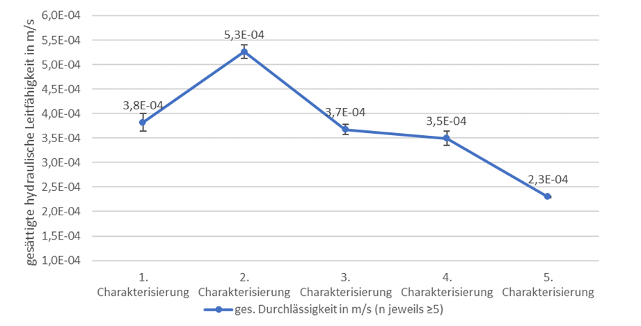

## Verwendete Substrate

### Substrate zur Filterung (LsW)

!!! abstract
    Regenwasser von Verkehrsflächen muss vor der Versickerung je nach Flächenkategorie gereinigt werden. Natürliche und technische Bodenfilter nach ÖNORM B 2506-2 bzw. ÖWAV RB 45 können die üblichen Schadstoffe zurückhalten und erfüllen damit die Anforderungen des Grundwasserschutzes. Die direkte Einleitung in Baumscheiben rückt in engen Stadträumen in den Fokus, ist aber normativ (noch) nicht voll abgedeckt.

Wird Regenwasser von Verkehrsflächen gezielt zur Versickerung gebracht,
ist je nach Flächenkategorie eine geeignete Reinigungsmaßnahme
einzuplanen (ÖWAV RB 45, 2015), um negative Auswirkungen auf das
Grundwasser durch Schadstoffe laut QZV Chemie GW (2010) zu verhindern.
Systeme mit Bodenfilter sind in der Lage die von Verkehrsflächen zu
erwartenden Schadstoffe rückzuhalten (ÖNORM B 2506-2, 2012) und
entsprechen somit der Anforderung der QZV Chemie GW (2010) an eine
„Bodenpassage". Unterschieden werden in der ÖNORM B 2506-2 natürliche
und technische Bodenfilter. Natürliche Bodenfilter bestehen aus belebtem
Oberboden, während bei technischen Bodenfiltern nach ÖNORM B 2506-2
(2012) dem belebten Oberboden Zuschlagstoffe im Ausmaß von 30
Masseprozent beigemengt werden dürfen.

Nach ÖWAV RB 45 (2015) setzt sich ein technischer Filter, darunter
fallen auch technische Bodenfilter laut ÖNORM B 2506-2, aus natürlichen
und/oder künstlichen Substraten zusammen, die dem Rückhalt und/oder
Abbau von anorganischen und organischen Stoffen dienen. Ihre Eignung
bezüglich Schadstoffrückhalt ist zu überprüfen (ÖWAV RB 45, 2015). Der
Filter gilt als geeignet, wenn die in ÖNORM B 2506-3 (2018) definierten
Anforderungen an technische Filter erfüllt werden.

Bevor Straßenwässer in den Schwammstadtsubstratkörper eingeleitet
werden, können diese in Sickerbecken oder Sickermulden mit natürlichem
Bodenfilter vorgereinigt werden. Es ist anzunehmen, dass diese, sofern
normgemäß eingebaut, ihre Filterfunktion gegenüber anfallenden
Schadstoffen erfüllen. Da die Sickerbecken im beengten urbanen
Straßenraum räumliche und finanzielle Ressourcen beanspruchen, gerät die
Einleitung von Straßenwasser direkt in die Baumscheibe in den Fokus.
Obwohl Baumsubstrate nicht als Filtersubstrate konzipiert sind, stellt
sich dennoch die Frage, welche Reinigungsleistungen zu erwarten sind.
Dabei ist zu beachten, dass kleinräumige Sickeranlagen (Sickermulden)
gemäß ÖNORM B 2506-2 (2012) grundsätzlich frei von Bewuchs mit Bäumen
und Sträuchern zu halten sind. Laut DWA-Arbeitsblatt A 138 (2005) soll
zwischen Versickerungsmulden und Bäumen ein Abstand von mindestens der
Hälfte des möglichen Kronendurchmessers eingehalten werden. Zukünftig
könnte die Pflanzung von Bäumen in Sickermulden jedoch erlaubt sein, wie
im Entwurf des neuen DWA-A 138-1 (2020) thematisiert wird.

Mit Hilfe von Säulenversuchen wurden drei Baumsubstratvarianten auf den
Rückhalt von Schadstoffen aus Dach- und Straßenabwässer unter
Laborbedingungen nach ÖNORM B 2506-3 (2018) untersucht. Jede
Substratvariante wurde mit drei Wiederholungen geprüft. Die erste
untersuchte Variante repräsentierte ein in Graz eingesetztes
Baumsubstrat und bestand aus mineralischen (5 Volumenteile) und
organischen (1 Volumenteil) Komponenten. Der mineralische Anteil wurde
von 5 Vol.-% Murschwemmmaterial, 10 Vol.-% Kantkorn 0/32 ungewaschen und
85 Vol.-% Rundkornsand 0/16 mm gewaschen gebildet. Der organische Anteil
setzte sich aus Kompost (Güteklasse A+) und Pflanzenkohle (EBC-AgroBio)
im Verhältnis 1 zu 1 zusammen. Um die Kohle mit Nährstoffen zu „beladen"
wurde diese im Vorfeld mit dem Kompost vermengt, durchfeuchtet und unter
mehrmaligem Wenden bei Zimmertemperatur für mindestens zwei Monate
stehen gelassen. Erst danach wurden die restlichen Komponenten
beigemengt.

Um einerseits den Einfluss des Murschwemmmaterials auf den
Schadstoffrückhalt zu untersuchen und andererseits die hydraulische
Durchlässigkeit des Baumsubstrats für eine effizientere Wasseraufnahme
zu erhöhen, wurde auf die Beimengung des Schwemmmaterials in der
Mischung der Variante 2 verzichtet. Das Baumsubstrat setzte sich
wiederum aus mineralischen (5 Volumenteile) und organischen (1
Volumenteil) Bestandteilen zusammen. Die mineralische Komponente bestand
aus 87 Vol.-% Rundkornsand 0/16 gewaschen und 13 Vol.-% Kantkorn 0/32
ungewaschen. Der organische Bestandteil wurde aus Kompost (Güteklasse
A+) und Pflanzenkohle (EBC-AgroBio) im Verhältnis 1 zu 3 gebildet. Die
„Beladung" der Kohle erfolgte ident zur Variante 1.

Der mineralische Substratanteil der Variante 3 glich jenem der Variante
2 und enthielt somit kein Murschwemmmaterial. Um die Auswirkungen der
Pflanzenkohle und des Komposts auf den Schadstoffrückhalt und die
hydraulische Durchlässigkeit zu evaluieren, wurde im Vergleich zu
Variante 2 der organische Anteil an der Gesamtmischung erhöht.
Zusammengesetzt war das Substrat aus 5 Volumenteilen mineralischer sowie
2,5 Volumenteilen organischer Komponenten. Der mineralische Teil bestand
aus 87 Vol.-% Rundkornsand 0/16 gewaschen und 13 Vol.-% Kantkorn 0/32
ungewaschen. Der organische Teil setzte sich aus Kompost (Güteklasse A+)
und Pflanzenkohle (EBC-AgroBio) im Verhältnis 1 zu 3 zusammen, wobei
ebenfalls eine „Beladung" der Kohle stattfand.

Alle drei untersuchten Baumsubstratvarianten erfüllen die in ÖNORM B
2506-3 (2018) festgelegten Anforderungen hinsichtlich des Rückhalts der
Schadstoffe. Auch die gesättigte hydraulische Leitfähigkeit sowie die
Infiltrationsrate zu Beginn der Versuche aller Substratvarianten
entsprechen der Norm (siehe Tab. 2). Hohe Chloridkonzentrationen in den
Proben zur Schwermetallremobilisierung führten bei der Laboranalyse zu
hohen Bestimmungsgrenzen für die untersuchten
Schwermetallkonzentrationen, weshalb zur Schwermetallremobilisierung
keine Aussage getroffen werden kann. Nicht erfüllt werden die
Anforderungen bezüglich der anfänglichen Trübung, sowie der Abnahme der
Infiltrationsrate im Laufe des Versuchs, wobei die Baumsubstratvariante
1 diese nur knapp nicht erfüllt (siehe Tab. 2). Weitere Informationen zu
den durchgeführten Versuchen finden sich im Bericht „Ermittlung der
Filtereigenschaften von Stadtbaumsubstraten" vom Oktober 2023.

**Tabelle 2: Ergebnisse zur Prüfung von Baumsubstratvarianten für die
Verwendung als technisches Filtermaterial nach ÖNORM B 2506-3 (2018); n
steht für die Anzahl an durchgeführten Messungen bzw. analysierten
Proben**

Prüfung | Schwermetall | Einheit | n | Anforderung lt. ÖNORM B2506-3 (2018) | Baumsubstrat-variante 1 | Baumsubstrat-variante 2 | Baumsubstrat-variante 3
---------|---------------|----------|---|--------------------------------------|--------------------------|--------------------------|--------------------------
**Trübung** |  | NTU | 1 | < 10 | **> 10** | **> 10** | **> 10**
**Gesättigte hydraulische Leitfähigkeit** |  | m/s | > 5 | > 7,2 × 10⁻⁶ (0,6 l/m² min) | **3,5 × 10⁻⁵** | **4,1 × 10⁻⁴** | **4,0 × 10⁻⁴**
**Infiltrationsrate** |  | m/s | > 5 | ≥ 1,0 × 10⁻⁵ | **2,4 × 10⁻⁵** | **8,6 × 10⁻⁵** | **8,5 × 10⁻⁵**
**Abnahme der Infiltrationsrate** |  | % | > 5 | < 50 | **50,8** | **71,8** | **70,7**
**Partikelrückhalt** |  | % | 27 | > 80 | **99,7** | **99,8** | **99,7**
**Partikelremobilisierung** |  | mg | 3 | < 800 bzw. < 1600 | **31,0** | **< 5,4** | **< 8,2**
**Mineralölrückhalt** |  | % | 12 | > 95 | **> 98** | **≥ 99** | **> 99**
**Schwermetallrückhalt (Konzentrationsstufe 2)** – Pb | Pb | mg/l | 15 | < 0,0090 | **< 0,0020** | **< 0,0039** | **< 0,0032**
**Schwermetallrückhalt (Konzentrationsstufe 2)** – Cu | Cu | % | 15 | > 80 | **> 98** | **> 82** | **> 82**
**Schwermetallrückhalt (Konzentrationsstufe 2)** – Zn | Zn | % | 15 | > 50 | **> 99** | **> 93** | **> 93**
**Schwermetallremobilisierung** – Cu | Cu | mg/l | 3 | < 0,05 | **< 0,50** | **< 0,50** | **< 0,50**
**Schwermetallremobilisierung** – Zn | Zn | mg/l | 3 | < 0,50 | **< 1,00** | **< 0,20** | **< 1,00**

Anforderungen der ÖNORM B 2506-3 werden erfüllt

Anforderungen der ÖNORM B 2506-3 werden nicht erfüllt

Aufgrund von zu hohen Bestimmungsgrenzen keine klare Aussage möglich

Die Versuchsbeschreibung in ÖNORM B2506-3 (2018) lässt darauf schließen,
dass bei der Erstellung der Norm Pflanzsubstrate als Filtermaterialien
noch nicht mitbedacht wurden. Dies zeigt sich beispielsweise anhand des
vorgegebenen Säulendurchmessers von 10 cm, welcher für grobkörnige
Substrate unterdimensioniert ist. Auch das vorgegebene
Trübungskriterium, welches Aussagen zur Gefügestabilität von
Filtermaterialien liefern soll, lässt sich für Substrate mit Kompost-
und Pflanzenkohlebeimengung kaum einhalten. Aufgrund der hohen
Farbaktivität von Pflanzenkohle und Kompost kann davon ausgegangen
werden, dass in der vorgegebenen Zeit keine vollständige Klärung des
Eluats möglich ist, was jedoch keine negativen Auswirkungen auf die
Gefügestabilität sowie den Schadstoffrückhalt des Substrats haben
dürfte. Dazugesagt sei, dass laut ÖWAV-Regelblatt 45 (2015) Kompost für
den Einsatz als technisches Filtermaterial als nicht geeignet eingestuft
wird.

Der geringere Anteil an feinkörnigen Bestandteilen bei den Varianten 2
und 3 ergab eine erhöhte hydraulische Leitfähigkeit im Vergleich zu
Variante 1, bei einem laut ÖNORM B 2506-3 (2018) ausreichend hohen
Schadstoffrückhalt. Der erhöhte organische Anteil (primär Pflanzenkohle)
bei Variante 3 im Vergleich mit Variante 2 hatte keine Auswirkungen auf
die Infiltrationsrate, bei einem ebenfalls ausreichend hohen
Schadstoffrückhalt. Aufgrund der durchwegs hohen Rückhalteraten lässt
sich diesbezüglich kein Vergleich zwischen den drei Varianten anstellen.
Zu klären bleibt, ob die Varianten 2 und 3 auch die bodenphysikalischen
Anforderungen der FLL (2010) an Baumsubstrate (beispielsweise bezüglich
Wasserhaltekapazität) erfüllen.

Im Sinne des Grundwasserschutzes erzielten die untersuchten
Baumsubstrate eine hohe Filterwirkung gegenüber gängigen Schadstoffen.
Bei Direkteinleitung von Straßenwässern in Baumscheiben würden dennoch
Schadstoffe oberflächennah in den Wurzelraum gelangen, womit Stadtbäume
in ihrem Wachstum beeinträchtigt werden könnten. Außerdem ist, wie auch
bei anderen Filtersystemen ein notwendiger Austausch von Filtermaterial
vorzusehen, was im Bereich des Wurzelraums eine praktische
Herausforderung darstellt. Denkbar wäre ein mehrschichtiger Aufbau in
Baumscheiben, mit einer Filterschicht im oberen Bereich und einem auf
optimiertes Baumwachstum im Sinne der FLL-Richtlinien (2010) ausgelegtem
Substrat darunter. Das Filtersubstrat könnte beispielsweise für einen
Austausch abgesaugt werden, wobei Schäden am Wurzelsystem zu vermeiden
sind.

Zusätzlich zu den Filterversuchen wurde die Baumsubstratvariante 1 im
Labor hydrologisch charakterisiert. Zum direkten Vergleich wurde ein
natürlicher Bodenfilter aus einem exemplarischen Sickerbecken im
Leonhardgürtel ebenfalls bodenhydrologisch analysiert. Die Ergebnisse
sind in der Tab. 3 dargestellt. Der natürliche Bodenfilter wurde mit
Hilfe von Stechzylindern im HYPROP-Verfahren bestimmt, wobei ungestörte
Bodenproben vor Ort entnommen wurden. Das Baumsubstrat (gestörte Proben)
wurde aufgrund der gröberen Körnung mittels Multi-Step-Outflow-Verfahren
(MSO) untersucht. Unterschiede zeigen sich vor allem in der Fähigkeit
Wasser pflanzenverfügbar zu speichern. Diese ist beim Baumsubstrat im
Vergleich mit natürlichem Boden reduziert, was auf den höheren Anteil an
grobkörnigem Material zurückzuführen ist. Grobkörniges Material wird bei
Baumsubstraten eingesetzt, um die Verdichtungsanfälligkeit zu minimieren
und somit möglichst dauerhaft eine ausreichend hohe Luftkapazität im
Wurzelraum zu gewährleisten. Detailliertere Informationen können dem
Bericht „Hydrologische Charakterisierung der Substrate" vom August 2022
entnommen werden. 

**Tabelle 3: Bodenhydrologische und bodenphysikalische Eigenschaften
eines Bodenfiltersubstrats sowie eines nicht überbaubaren Baumsubstrats
unter Angabe des Mittelwerts und der Standardabweichung.**

Substrat | Natürlicher Bodenfilter | Baumsubstrat (Variante 1)
----------|-------------------------|----------------------------
**Wiederholungen** | 3 | 3
**Untersuchungsmethodik** | HYPROP | MSO
**Trockenrohdichte in t/m³** | 1,37 ± 0,05 | 1,72 ± 0,02
**Gesamtporenvolumen in Vol.-%** | 44,4 ± 1,8 | 33,5 ± 0,3
**Ges. hydr. Leitfähigkeit in m/d** | 2,7 ± 0,4 | 3,1 ± 0,2
**Wasserkapazität 2 h in Vol.-%** | / | 29,8 ± 0,8
**Wasseranteil bei pF 1,8 in Vol.-%** | 35,5 ± 0,6 | 16,4 ± 0,7
**Permanenter Welkepunkt in Vol.-%** | 16,2 ± 0,0 | 4,0 ± 0,1

!!! info
    Für weitere Informationen siehe Bericht [Hydrologische Charakterisierung der Substrate von Land Schafft Wasser](...)

    Ansprechpartner: 

    - [Land schafft Wasser](https://www.landschafftwasser.at/)
    - [JR AquaConSol](https://www.jr-aquaconsol.at/)
    

### Überbaubare Substrate

!!! abstract 
    Das Schwammstadtsubstrat ist ein grob aufgebautes, überbaubares Struktursubstrat, das im Labor (Mikrolysimeter) und im Großlysimeter sehr ähnliche hydraulische Kennwerte zeigte. Es hat hohe Durchlässigkeit und Luftkapazität, aber deutlich geringere pflanzenverfügbare Wasserspeicherung als natürliche Böden oder nicht überbaubare Baumsubstrate. Deshalb braucht es genügend Volumen bzw. Nachspeisung.

Das Schwammstadtsubstrat als spezielles überbaubares Struktursubstrat
stellt aufgrund seiner Zusammensetzung und der Einbauweise eine
besondere Herausforderung für die Untersuchung seiner
bodenhydrologischen und bodenphysikalischen Eigenschaften dar. Vor allem
die Dimensionen des Grobschlags (90/125 mm) sowie der getrennte Einbau
von Feinsubstrat und Grobschlag bildeten die Grundlage für die
Entwicklung einer adaptierten Labormethodik in Mikrolysimetern (Rath,
2023). Zur Erhöhung der Praktikabilität und aufgrund der beschränkten
Dimensionen im Labor wurde die entwickelte Methodik mit kleiner
dimensioniertem Grobschlag (32/63 mm) durchgeführt.

Des Weiteren wurde ein Großlysimeterversuch durchgeführt, der eine
hydrologische Charakterisierung des Struktursubstrats in Realmaßstäben
zuließ. Der Versuch wurde mit Grobschlag mit einer Körnung von 90/125
mm, einem Probenvolumen von 0,46 m³ und einem realitätsgetreuen
zweischichtigen Einbau abgewickelt.

In Tabelle 4 sind die wichtigsten hydrologischen Kennwerte beider
Versuche gegenübergestellt. Erkennbar sind die sehr ähnlichen Werte
bezüglich gesättigter Durchlässigkeit und Gesamtporenvolumen. Die
jeweiligen Differenzen liegen innerhalb der errechneten
Standardabweichung für die durchgeführten Mikrolysimeterversuche.
Größere Unterschiede sind bei der Wasserkapazität nach 2 Stunden (WK 2h)
feststellbar. Bei den Mikrolysimeterversuchen betrug die WK 2h 9,7 ± 0,3
Vol.-%, während das Schwammstadtsubstrat beim Großlysimeterversuch eine
Wasserkapazität (WK 2h) von 7,6 Vol.-% aufwies.

Ein interessanter Vergleich ergibt sich aus der Wasserkapazität nach
48 Stunden (WK 48h) beim Großlysimeterversuch und dem Wasseranteil bei
einem pF-Wert von 1,8 bei den Mikrolysimeterversuchen. Beide Werte
können je nach Definition als Wasseranteil bei Feldkapazität bezeichnet
werden (Scheffer et al., 1984; Wessolek et al., 2009), wobei sich die
jeweilige Untersuchungsmethodik unterscheidet. Während bei Bestimmung
des Wasseranteils bei einem pF-Wert von 1,8 ein Unterdruck an die Probe
angelegt wird, dräniert bei Bestimmung der WK 48h die Probe frei. Die
Werte sind mit 6,5 Vol.-% und 6,1 Vol.-% sehr ähnlich, die Differenz von
0,4 Vol.-% liegt innerhalb der errechneten Standardabweichung für die
Laborversuche.

Grundsätzlich wiesen beide Versuche ähnliche Werte auf, was für die
Aussagekraft der Versuche spricht. Ein möglicher Grund für die
Unterschiede bezüglich der Wasserkapazität nach zweistündiger Dränierung
könnten die unterschiedlichen Ausgangsmaterialien der jeweiligen
Feinsubstrate sein, bei denen zwar die Produktbezeichnung ident, die
Hersteller jedoch andere waren. Vor allem der anteilsmäßig dominierende
Sand könnte aufgrund von Unterschieden in der Porengrößenverteilung zu
variierenden Wasserhaltekapazitäten geführt haben. Ausführlichere
Informationen zu den Versuchen finden sich in den Berichten
„Hydrologische Charakterisierung der Substrate" vom August 2022 sowie
„Großlysimeter -- Schwammstadtsubstrat" vom Juni 2024.

Generell weist das untersuchte Struktursubstrat im Vergleich zu
natürlichen Böden bzw. zu nicht überbaubaren Baumsubstraten (siehe Tab.
3) eine höhere gesättigte hydraulische Leitfähigkeit sowie eine höhere
Luftkapazität auf (siehe Tab. 4). Dies ist vor allem für die Funktion
des Struktursubstrats als Regenwasserretentionsraum und für eine
ausreichende Versorgung der Baumwurzeln mit Sauerstoff relevant. Die
Fähigkeit Wasser pflanzenverfügbar zu speichern ist mit rund 6-7 Vol-%
aufgrund des hohen Anteils an groben Steinen (ca. 60 Vol.-%) und des
vergleichsweise geringeren Feinsubstratanteils im Vergleich zu
natürlichen Böden oder nicht überbaubaren Baumsubstraten deutlich
reduziert.

In der Praxis bedeutet dies, dass Struktursubstrate nach dem
Stockholm-System nur verwendet werden sollten, um den Wurzelraum für
Stadtbäume unter versiegelten oder verdichteten Flächen in urbanen
Gebieten zu erweitern. Zudem soll die geringere Wasserkapazität durch
ausreichend große Volumina an Struktursubstrat ausgeglichen und/oder für
eine regelmäßige Auffüllung des vorhandenen Bodenwasserspeichers gesorgt
werden. Für Stadtbaumpflanzungen empfiehlt es sich trotz Einsatz von
überbaubaren Struktursubstraten, ausreichend große Baumscheiben mit
nicht überbaubaren Baumsubstraten bereitzustellen, um insbesondere in
den ersten Standjahren optimale Wuchsbedingungen für die Stadtbäume zu
schaffen.

**Tabelle 4: Vergleich zweier Untersuchungsmethoden zur Bestimmung der
bodenphysikalischen und bodenhydrologischen Eigenschaften des
Schwammstadtsubstrats; ∆ steht für die Differenz zwischen den
Einzelwerten des Großlysimeterversuchs und den Mittelwerten der
Mikrolysimeterversuche.**

Versuchsbezeichnung | Großlysimeterversuch (2024) | Laborversuche (Mikrolysimeter, 2022) | ∆
--------------------|------------------------------|--------------------------------------|---
**Wiederholungen** | 1 | 9 |  
**Probenvolumen in m³** | 0,46 | 0,009 |  
**Verwendeter Grobschlag in mm** | 90/125 | 32/63 |  
**Feinsubstratanteil am Gesamtvolumen in Vol.-%** | 25 | 25 |  
**Trockenrohdichte in t/m³** | 2,07 | 2,01 ± 0,02 | 0,06
**Gesamtporenvolumen in Vol.-%** | 27,1 | 26,2 ± 1,0 | 0,9
**Ges. hydr. Leitfähigkeit in m/d** | 33,0 | 36,9 ± 6,5 | 3,9
**Wasserkapazität 2 h in Vol.-%** | 7,6 | 9,7 ± 0,3 | 2,1
**Wasserkapazität 48 h (Großlysimeter)** / **Wasseranteil bei pF 1,8 (Mikrolysimeter) in Vol.-%** | 6,5 | 6,1 ± 0,9 | 0,4
**Permanenter Welkepunkt in Vol.-%** | / | 1,08 | /

!!! info
    Für weitere Informationen siehe Bericht [Hydrologische Charakterisierung der Substrate von Land Schafft Wasser](...)

    Ansprechpartner: 

    - [Land schafft Wasser](https://www.landschafftwasser.at/)
    - [JR AquaConSol](https://www.jr-aquaconsol.at/)
    

### Beständigkeit / Langzeittests (JR ACS, LsW)

!!! abstract
    Im Großlysimeterversuch wurden wiederholte Wassereinträge und ein sehr hoher, für Graz hochgerechneter Partikeleintrag simuliert. Feinsubstrat wanderte dabei in tiefere Zonen, ohne die Gesamtfunktion merklich zu verschlechtern. Die gesättigte Durchlässigkeit blieb weitgehend erhalten, der Partikelrückhalt war sehr hoch (>99 %), sodass auch langfristig eine gute Funktionsfähigkeit des Struktursubstrats zu erwarten ist.

Der im vorherigen Kapitel 2.2. beschriebene Großlysimeterversuch sollte
auch die Frage klären, inwiefern sich die hydrologischen Eigenschaften
von überbaubaren Struktursubstraten im Laufe der Zeit verändern. Es ist
anzunehmen, dass der Struktursubstratkörper durch wiederholten
Wassereintrag, fortschreitende Durchwurzelung und dem Eintrag von
Feinanteilen Veränderungen unterliegt. Der Wassereintrag in das
Schwammstadtsystem kann unter anderem schwallartig über Voll- bzw.
Teilsickerrohre erfolgen. Eine mögliche Folge ist die interne
Verlagerung des Feinsubstrats in tiefere Schichten des Substratkörpers,
was Veränderungen der hydrologischen Funktionalität zur Folge haben
könnte. Falls Feinteile von urbanen Zuflüssen ebenfalls miteingeschwemmt
werden, ist vor allem eine Reduktion der Durchlässigkeit denkbar.

Im Rahmen des Großlysimeterversuchs wurde den aufgeworfenen Fragen
nachgegangen. Dafür wurde ein großvolumiger Schacht realitätsgetreu mit
zwei Schichten des Schwammstadtsubstrats á 30 cm Höhe befüllt und
mehrmals mit Reinwasser beregnet. Substratcharakterisierungen zu
verschiedenen Zeitpunkten sollten Aufschluss über die Veränderungen im
Substratkörper geben. In einem zweiten Schritt wurde derselbe
Substratkörper zusätzlich zur Beregnung mit Reinwasser mit Quarzmehl
beaufschlagt, um einen Partikeleintrag zu simulieren. Nach jeder
Beregnung, sowie nach den Einschlämmvorgängen des Feinsubstrats wurde
eine Mischprobe aus dem gesammelten Ausfluss entnommen und auf gängige
grundwasserrelevante Parameter untersucht.

Der durchgeführte Versuch hat gezeigt, dass die Einschlämmvorgänge des
Feinsubstrats in die Hohlräume des Grobschlags zu einer vertikal
ungleichmäßigen Verteilung von Feinsubstrat führen. Weitere
Wassereinträge verstärkten diesen Effekt, wodurch die obersten 20 cm im
Struktursubtratkörper einen höheren Grobporenanteil und somit einen
geringeren Feinsubstratanteil aufwiesen (siehe Abbildung 3). Die
Versuche deuteten weiters auf eine vermehrte Ansammlung von Feinsubstrat
an der Grenzfläche der zwei eingebrachten Struktursubstratschichten
(30-40 cm über Substratunterkante) hin. Zusätzlich durchgeführte
Versuche lassen außerdem eine Feinsubstratakkumulation in den untersten
Zentimetern des Substratkörpers vermuten. Grundsätzlich sind durch diese
Effekte keine nachteiligen Wirkungen auf die Funktionalität des Systems
zu erwarten. Auch ist davon auszugehen, dass die Baumwurzeln gezielt in
diese Bereiche vordringen, da hier die Wasserkapazität sowie der
Nährstoffgehalt höher sind. Das Gesamtporenvolumen sowie die
Wasserkapazität verändern sich dadurch nur lokal, bleiben über den
gesamten Substratkörper jedoch weitgehend gleich. Dies zeigte auch der
Großlysimeterversuch. Zusätzlich ist zu erwarten, dass das Vordringen
der Baumwurzeln in das Struktursubstrat zu einer verbesserten
Stabilisierung des Feinsubstrats im Skelettkörper führt.

**Abbildung 3:** **Stufenweiser Grobporenanteil im Laufe des Versuchs
als Liniendiagramm; Die Punkte sind in der Mitte des jeweiligen
Substratbereichs aufgetragen.**

Die gesättigte Durchlässigkeit nahm durch die Wassereinträge nicht ab,
auch erhebliche Partikeleinträge führten nur zu einer leichten Abnahme
(siehe Abbildung 4), was darauf hindeutet, dass die hohe Durchlässigkeit
auch nach Jahrzehnten gegeben ist und die Gefahr eines Rückstaus als
gering einzustufen ist. Das aufgebrachte Quarzmehl entsprach einem
simulierten Partikeleintrag für die Stadt Graz von rund 90 Jahren bei
einem Flächenverhältnis von Struktursubstratoberfläche zu Einzugsgebiet
von 1:1 (Annahme laut ÖNORM B 2506-3 (2018): 90 mg Partikel je Liter
Straßenabfluss). Weiters lassen die Ergebnisse vermuten, dass die
Sättigungsvorgänge während der Versuchsdurchführung zur Wiederöffnung
von durch Quarzmehl verschlossenen Porengängen geführt haben könnten.
Bei Schwammstadtsystemen mit Wasseranstau sind in der Realität ähnliche
Vorgänge denkbar.

**Abbildung 4: Gesättigte hydraulische Leitfähigkeit des untersuchten
Struktursubstrats im Laufe des Versuchs**

Die analysierten Wasserproben überschritten nur während der
Einschlämmvorgänge die Schwellenwerte der QZV Chemie GW (2010) und der
Trinkwasserverordnung (2001). Dies galt für die Parameter Chlorid,
Nitrit und Ammonium. Hierbei handelt es sich um kurzzeitig auftretende
Überschreitungen der Schwellenwerte, die abhängig vom gewählten
Feinsubstrat im Sickerwasser des Struktursubstrats möglich sind.
Gemessen wurde somit der Emissionswert. Die während des weiteren
Versuchablaufs eingebrachten hohen Wassermengen sorgten anschließend für
eine rasche Auswaschung von mobilen Stoffen.

Zu beachten ist, dass auf Grund von Mineralisierungs- und
Umwandlungsprozessen im Substratkörper, sowie auch erwartbaren erhöhten
Konzentrationen des städtischen Oberflächenwassers, das für blau-grüne
Infrastrukturelemente als Ressource dient, für verschiedene Parameter im
realen Setting abweichende Werteverläufe, vor allem auch mit mehr
Dynamik nach dem ersten Auswaschungsprozess, zu erwarten sind. Weiters
spielt die Qualität der Substratkomponenten eine wesentliche Rolle.
Bezüglich des eingebrachten Quarzmehls wies das untersuchte
Struktursubstrat einen Partikelrückhalt von über 99 % auf.

Trotz der Verlagerung von Feinsubstrat und des simulierten
Partikeleintrags legen die Versuche nahe, dass das untersuchte
Struktursubstrat über einige Jahrzehnte seine Funktionalität beibehält.
Grundsätzlich ist zu beachten, dass der durchgeführte Versuch im
Laborsetting stattfand und nicht alle in der Realität auftretenden
Parameter (z.B. Verdichtung des Grobschlags mittels Rüttelplatte)
simuliert werden konnten. Auch war der Einfluss der Wurzeln auf die
bodenhydrologischen Parameter nicht Gegenstand der Untersuchungen.
Weitere Details zur Versuchsmethodik und zu den erzielten Ergebnissen
können dem Bericht „Großlysimeter -- Schwammstadtsubstrat" vom Juni 2024
entnommen werden.

!!! info
    Ansprechpartner: 

    - [Land schafft Wasser](https://www.landschafftwasser.at/)
    - [JR AquaConSol](https://www.jr-aquaconsol.at/)
    