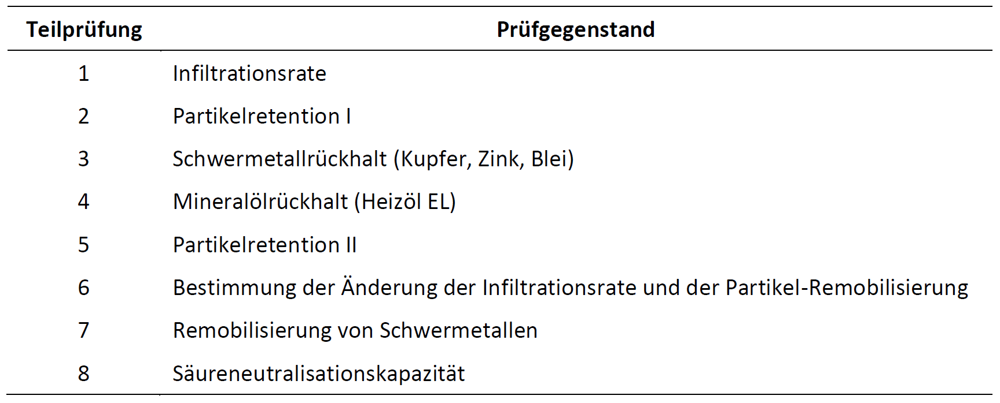
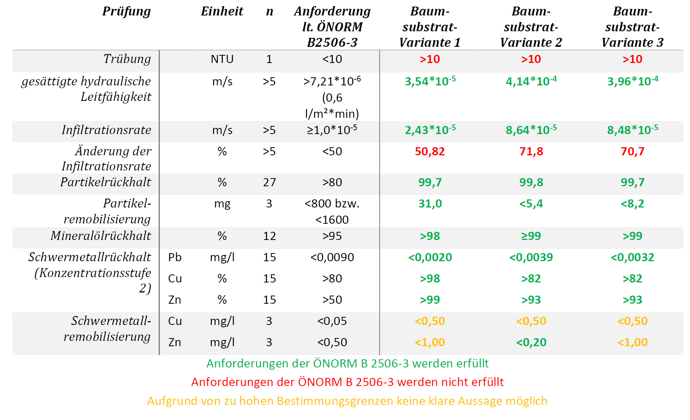

!!! abstract
    Simulationsmodelle sind Berechnungsprogramme, mit denen in der Natur ablaufende Prozesse mathematisch beschrieben werden. Je nachdem welche Prozesse für die zu klärende Fragestellung wesentlich sind, kommen unterschiedliche Modellkonzepte und Softwarepakete zum Einsatz. Damit verbunden sind auch unterschiedliche Anforderungen an die Inputdaten für das Aufsetzen und die Anwendung eines Simulationsmodells.

Optimierte Baumstandorte können als Element der blau-grünen Infrastruktur einen wertvollen Beitrag zur Klimawandelanpassung in Städten leisten. In solchen Systemen werden zumeist größere Mengen an Niederschlagsabfluss von befestigten Flächen über verschiedene Wege in den Wurzelraum von Stadtbäumen eingeleitet. Als Beispiel kann das in Österreich angewandte System Schwammstadt für Bäume genannt werden (Grimm et al., 2021).

Hierfür ist je nach Herkunft und somit Verschmutzungskategorie des Oberflächenabflusses für die Gewährleistung des Baum- und Grundwasserschutzes eine geeignete Reinigungsanlage vorzusehen, die vor der Zuleitung in den Wurzelraum passiert wird (ÖWAV, 2015). Die grundsätzlich populäre Variante des belebten Bodenfilters in Mulden- oder Beckenform steht im städtischen Straßenraum unter anderem der Problematik des beschränkten Platzangebots gegenüber, was die Ausführung als Becken nahelegt. Dies zieht in weiterer Folge auch einen gewissen finanziellen Aufwand nach sich. Je nach Größe der städtischen hydrologischen Einzugsgebiete, die für eine Einleitung in die optimierten Baumstandorte vorgesehen sind, können hier normgemäß beachtliche Flächen für solche Reinigungsanlagen notwendig werden, die zusätzlich zu den Baumscheiben im Straßenraum etabliert werden müssten. Vorteile einer solchen Anlage sind zum Beispiel die biodiverse und gestalterisch ansprechende Gestaltungsmöglichkeit, sowie auch die Zufuhr des gesamten Oberflächenabflusses in den Wurzelraum.

Ein alternativer Ansatz verfolgt die Abtrennung des stärker verunreinigten ersten Spülstoßes in den Kanal und die Einleitung des darüberhinausgehend anfallenden Oberflächenabflusses mit geringerem Schadstoffgehalt in den Wurzelraum. Die Trennung dieser beiden Kategorien kann aktiv – beispielsweise durch einen drehbaren Stein – oder passiv, wie dies z.B. bei der Wiener Drossel der Fall ist, erfolgen. Möchte man den Anteil des Niederschlagswassers, der in den Wurzelraum geleitet wird, mittels eines belebten Bodenfilters reinigen, so kann das Becken kleiner dimensioniert werden und lässt sich somit einfacher in den urbanen Straßenraum einfügen. Eine solche gänzliche Abtrennung eines ersten Spülstoßes bestimmter Größenordnung führt allerdings zwangsläufig zu einer Reduktion des den Bäumen zugeführten Wassers und kann daher die Trockenstressproblematik intensivieren und in weiterer Folge zu verminderter Vitalität führen (Pressl et al., 2021).

In Anbetracht der genannten Herausforderungen gerät die Einleitung von Straßenwässer direkt in die Baumscheibe in den Fokus, um räumliche und finanzielle Ressourcen zu schonen und dem Baum möglichst viel Wasser zur Verfügung stellen zu können. Obwohl Baumsubstrate nicht als Filtersubstrate konzipiert sind, stellt sich dennoch die Frage, welche Reinigungsleistungen bezüglich häufig anfallender Schadstoffe zu erwarten sind, und welche Rolle Pflanzenkohle als Zuschlagsstoff für den Schadstoffrückhalt spielen kann.

Mit Hilfe von Säulenversuchen sollen verschiedene Baumsubstrate auf den Rückhalt ausgewählter Schadstoffe aus Dach- und Straßenabwässern unter Laborbedingungen untersucht werden.

Ziel der Säulenversuche ist die Beurteilung von unterschiedlichen Filtermaterialien hinsichtlich ihrer Entfernungseffizienz für ausgewählte Kontaminanten von Dach- und Straßenabwässern wie Schwermetallen, Partikeln und Mineralölen unter vergleichbaren Laborbedingungen. Das experimentelle Design der Säulenversuche orientiert sich methodisch an der ÖNORM B 2506-3. Die genannte ÖNORM beschreibt grundsätzlich die Anforderungen und Prüfungen von technischen Filtermaterialien (nach ÖWAV-Regelblatt 45) in Regenwasser-Sickeranlagen zur Reinigung von Niederschlagsabflüssen von Zinkdächern, Kupferdächern und befestigten Flächen (z.B. Straßen). Für die Untersuchungen im gegenständlichen Projekt werden jedoch verschiedene Baumsubstrate untersucht, wodurch die in der ÖNORM B 2506-3 definierten Anforderungen und Prüfkriterien nur orientierenden Charakter haben. Auch beim Versuchsdesign und der Durchführung der Prüfversuche wird auf diese genormten Grundlagen zurückgegriffen.

#### Überblick

Alle Prüfungen werden als Säulenversuche durchgeführt. Die Prüfung besteht aus acht Teilprüfungen, die für die einzelnen Substrate gemäß der ÖNORM B 2506 3 in folgender Reihenfolge durchgeführt werden (siehe Tabelle 1)

Tabelle 1: Überblick über die Teilprüfungen

#### Filtersubtrate
Für die Säulenversuche werden drei Varianten des im Leonhardgürtel Graz verwendeten Baumsubstrats untersucht.
###### Variante 1: Wie im LHG verbaut mit 8 % „unbeladener“ Pflanzenkohle
Das verwendete Baumsubstrat besteht aus mineralischen (5 Volumenteile) und organischen (1 Volumenteil) Komponenten. Der mineralische Anteil wird von 10 Vol.-% Murschwemmmaterial, 10 Vol.-% Kantkorn 0/32 und 80 Vol.-% Rundkornsand 0/8 mm ungewaschen gebildet. Der organische Anteil setzt sich aus Kompost und „unbeladener“ Pflanzenkohle im Verhältnis 1 zu 1 zusammen.
###### Variante 2: Wie im LHG verbaut mit 8 % „beladener“ Pflanzenkohle
Für die zweite Variante wird Baumsubstrat mit demselben Mischungsverhältnis wie für Variante 1 verwendet. Im Unterschied zu vorangegangener Variante wird mit Nährstoffen „aufgeladene“ Pflanzenkohle eingesetzt. Hierfür wird die Kompostkohlemischung im Vorfeld durchfeuchtet und unter mehrmaligem Wenden bei Zimmertemperatur für mindestens zwei Wochen stehen gelassen.
###### Variante 3: Pflanzenkohleanteil („beladen“) auf 25 % erhöht 
Als dritte Variante wird die Filterkapazität des Baumsubstrats mit erhöhtem Pflanzenkohleanteil untersucht. Das Mischungsverhältnis beträgt hierbei 5 Volumenteile mineralische Bestandteile zu 2,5 Volumenteile organische Komponenten. Während der mineralische Anteil in seiner Zusammensetzung gleich bleibt, besteht der organische Anteil aus Kompost und „aufgeladener“ Pflanzenkohle im Verhältnis 1 zu 3.
Die Materialien werden ohne Modifikation physikalischer oder chemischer Natur bei den Untersuchungen verwendet. Jede Substratvariante wird mit je drei Wiederholungen geprüft.

#### Zusammenfassung
Alle drei untersuchten Baumsubstratvarianten erfüllen die in ÖNORM B 2506-3 festgelegten Anforderungen hinsichtlich des Rückhalts der ausgewählten Schadstoffe. Auch die gesättigte hydraulische Leitfähigkeit sowie die Infiltrationsrate zu Beginn der Versuche aller Substratvarianten entsprechen der Norm (siehe Tabelle 2). Aufgrund von aufgetretenen Komplikationen im Zuge der Laboranalyse kann zur Schwermetallremobilisierung keine klare Aussage getroffen werden. Nicht erfüllt werden die Anforderungen bezüglich der anfänglichen Trübung, sowie der Abnahme der Infiltrationsrate im Laufe des Versuchs, wobei die Standard-Baumsubstratvariante 1 diese nur knapp nicht erfüllt (siehe Tabelle 2).

Tabelle 2: Zusammenfassung der Ergebnisse; n steht für die Anzahl an untersuchten Proben bzw. durchgeführten Messungen je Substratvariante

!!! info
    Für weitere Informationen siehe Bericht [MPGB Projekt NWB 4.0 Fa. AquaConSol - Modellhafte Nachbildung der Flutungsversuche am Standort Leonhardgürtel & Bestimmung des Schadstoffrückhalts (Säulenlaborversuche)](...)

    Ansprechpartner: 

    - [Land schafft Wasser](https://www.landschafftwasser.at/)
    - [Bundesamt für Wasserwirtschaft](https://www.baw.at/)
    - [JR AquaConSol](https://www.jr-aquaconsol.at/)