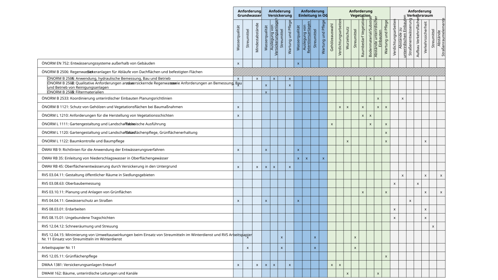

!!! abstract 

    In diesem Teil stehen Konzept, Planung und Dimensionierung im Mittelpunkt – mit Fokus auf normgerechte Auslegung, Genehmigungsfähigkeit und Betrieb im Grazer Stadtraum. Aufbauend auf den gesammelten Handlungsempfehlungen aus „Naturnahe Regenwasserbewirtschaftung 4.0“ (SWW TU Graz, 2022) sowie dem Stand der Technik aus ÖNORMEN, ÖWAV-Regelwerken, RVS und DWA werden Anforderungen systematisch für Grundwasser, Versickerung, Oberflächengewässer, Vegetation und Verkehrsraum strukturiert und den maßgeblichen gesetzlichen Rahmenbedingungen auf EU-, Bundes- und Landes-/Stadtebene gegenübergestellt. Ergänzend werden Potenziale und Restriktionen – insbesondere für Baumrigolen – bewertet und gezeigt, wie stark das Retentionspotenzial je nach Bemessungsstrategie (Starkregenvorsorge vs. Jahreswasserbilanz) variiert. Damit schafft Teil 3 eine belastbare Grundlage für die standortgerechte Auslegung, Genehmigungsfähigkeit sowie den dauerhaften Betrieb und die Wartung blau-grüner Maßnahmen im urbanen Straßenraum.

## Relevante Normen

Der Stand der Technik zur Dimensionierung wird über ÖNORMEN,
ÖWAV-Regelwerke, RVS und DWA-Regelwerke definiert. Hierbei wird sowohl
die wasserwirtschaftliche als auch die bautechnische Seite von dNWBs
betrachtet. Um einen besseren Überblick zu verschaffen, wurde die
Thematik in fünf Bereiche: Grundwasser, Versickerung,
Oberflächengewässer, Vegetation und Verkehrsraum gegliedert und
Unterkategorien erstellt. Die relevanten Werke wurden anschließend den
Kategorien zugeordnet. Tabelle 1‑1 stellt den Stand der Technik mit den
Kategorien in einer Matrix dar.

Tabelle 1-1: Stand der Technik - Matrix

{ target="_blank" }

Über den Stand der Technik hinaus sind noch die gesetzlichen Rahmenbedingungen auf EU-, Bundes-, Länder- und Bezirksebene zu beachten:

## Relevante Gesetze

### Europäische Union

- [Wasserrahmenrichtlinie](https://www.bmluk.gv.at/themen/wasser/gewaesserbewirtschaftung/eu_wrrl.html){ target="_blank" }
- [Grundwasserrichtlinie](https://www.bmluk.gv.at/themen/wasser/wasser-eu-international/rechtliche-aspekte/eu_wasserrecht/GW-Qualitaet-RL.html){ target="_blank" }
- [Trinkwasserrichtlinie](https://eur-lex.europa.eu/eli/dir/2020/2184/oj?locale=de){ target="_blank" }

### Österreich:

- [Wasserrechtsgesetz](https://www.bmluk.gv.at/themen/wasser/wasser-oesterreich/wasserrecht_national/wasserrechtsgesetz/WRG1959.html){ target="_blank" }
- [Allgemeine Abwasseremissionsverordnung](https://www.bmluk.gv.at/themen/wasser/wasser-oesterreich/wasserrecht_national/wasserrechtsgesetz/WRG1959.html){ target="_blank" }
- [Qualitätszielverordnung Chemie Grundwasser](https://www.bmluk.gv.at/themen/wasser/wasser-oesterreich/wasserrecht_national/planung/QZVChemieGW.html){ target="_blank" }
- [Qualitätszielverordnung Chemie Oberflächengewässer](https://www.bmluk.gv.at/themen/wasser/wasser-oesterreich/wasserrecht_national/planung/QZVChemieOG.html){ target="_blank" }
- [Qualitätszieverordnung Ökologie Oberflächengewässer](https://www.bmluk.gv.at/themen/wasser/wasser-oesterreich/wasserrecht_national/planung/QZVOekologieOG.html){ target="_blank" }
- [Gewässerzustandsüberwachungsverordnung](https://www.bmluk.gv.at/themen/wasser/wasser-oesterreich/wasserrecht_national/planung/GZUEV.html){ target="_blank" }
- [Trinkwasserverordnung](https://www.ris.bka.gv.at/geltendefassung/bundesnormen/20001483/twv,%20fassung%20vom%2001.04.2011.pdf){ target="_blank" }

### Steiermark/Graz

- [Steiermärkisches Kanalgesetz 1988](https://ris.bka.gv.at/NormDokument.wxe?Abfrage=LrStmk&Gesetzesnummer=20000938&FassungVom=2026-02-12&Artikel=&Paragraf=0&Anlage=&Uebergangsrecht=){ target="_blank" }
- [Steiermärkisches Baumschutzgesetz 1989](https://www.ris.bka.gv.at/NormDokument.wxe?Abfrage=LrStmk&Gesetzesnummer=20000912&FassungVom=2026-02-15&Artikel=&Paragraf=1&Anlage=&Uebergangsrecht=){ target="_blank" }
- [Vertragsbedingungen des Landes Steiermark - Technische Bestimmungen
  (Teil B5)](https://www.verkehr.steiermark.at/cms/dokumente/12724109_150373676/b8675630/B5_August_2024.pdf){ target="_blank" }
- [Streumittelverordnung Stadt Graz](https://www.umwelt.graz.at/cms/dokumente/10437657_13726541/48a7f248/Streumittelverordnung.pdf){ target="_blank" }
- [Baumschutzverordnung Stadt Graz](https://www.graz.at/cms/beitrag/10295911/8115447/Baumschutzverordnung.html){ target="_blank" }
- [Aufgrabungsrichtlinie Stadt Graz](https://www.graz.at/cms/beitrag/10321438/9231668/Aufgrabungsrichtlinie.html){ target="_blank" }
- [Verkehrsplanungsrichtlinie Stadt Graz](https://www.ris.bka.gv.at/Dokumente/Gemeinderecht/GEMRE_ST_60101_A10_8_012421_2011_0011/Verkehrsplaungsrichtlinie-Text_pdf_fertig.pdf){ target="_blank" }
- [Freiraumplanerische Standards Stadt Graz](https://www.graz.at/cms/beitrag/10080561/7759256/freiraumplanerische_standards.html){ target="_blank" }

!!! info
    Für weitere Informationen siehe Bericht [Naturnahe Regenwasserbewirtschaftung 4.0 - Handlungsempfehlungen für Grau und die Steiermark - Zwischenbericht](...)

    Ansprechpartner: 

    - [TU Graz - Institut für Siedlungswasserwirtschaft und Landschaftswasserbau](https://www.tugraz.at/institute/sww/home)

