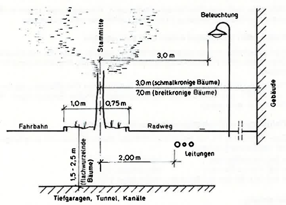
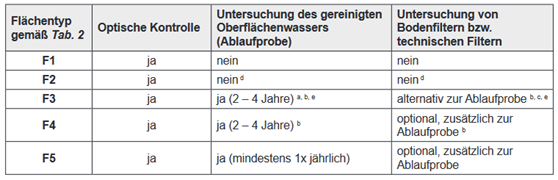
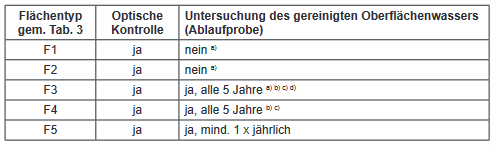

!!! abstract

    Die dargestellten Ergebnisse beziehen sich aus Erkenntnisse, die im Rahmen der Projektes NWB 4.0 vom Institut für Siedlungswasserwirtschaft der TU Graz erarbeitet wurden.

    Ansprechpartner: [Institut für Siedlungswasserwirtschaft](https:\\sww.tugraz.at)  
    Zuletzt aktualisiert: Dezember 2022

Die Planung und Umsetzung von Baumrigolen, Mulden und Versickerungsanlagen erfordert neben der Berücksichtigung der Untergrundverhältnisse auch eine sorgfältige Gestaltung und Bewirtschaftung der Oberfläche. Technische Regelwerke und Normen enthalten hierzu Anforderungen an die Integration in den Verkehrsraum, die Wasserqualität oberflächiger Abflüsse, die Pflege und Wartung von Vegetationsflächen, die Bewässerung sowie die Auswahl geeigneter Gehölze und deren Flächenbedarf.

Die nachfolgende Übersicht fasst die für die Oberflächengestaltung und den Betrieb von dNWB-Systemen relevanten Regelwerke thematisch zusammen und beschreibt deren Bezug zu den jeweiligen Planungsaspekten. Sie dient als Orientierungshilfe für die Auswahl und Anwendung der einschlägigen Normen und Richtlinien im Rahmen der Planung, Ausführung, Pflege und langfristigen Funktionssicherung naturnaher Regenwasserbewirtschaftungsanlagen.

## Anforderungen an Abstände im Verkehrsraum

### Straßenraumgestaltung und Grünflächenplanung

| Regelwerk                                                         | Relevanz für Regelungen zur Oberfläche                                                                                                                                                                                     |
| ----------------------------------------------------------------- | -------------------------------------------------------------------------------------------------------------------------------------------------------------------------------------------------------------------------- |
| RVS 03.04.11 – Gestaltung öffentlicher Räume in Siedlungsgebieten | Relevant für die Einordnung von dNWB-Elementen im öffentlichen Straßenraum, insbesondere hinsichtlich Flächenaufteilung, Aufenthaltsqualität, Sichtbeziehungen und Konflikten mit anderen Nutzungen.                       |
| RVS 03.10.11 – Planung und Anlage von Grünflächen                 | Behandelt Planung, Anlage und Sanierung von Grünflächen an öffentlichen Verkehrswegen und ist damit relevant für Abstände, Lage und Integration von Grünflächen, Baumstandorten und oberflächennahen Regenwassermaßnahmen. |

## Anforderungen an die Wasserqualität

### Schutz des Grundwassers

| Regelwerk                                                                                      | Relevanz für Regelungen zur Oberfläche                                                                                                                 |
| ---------------------------------------------------------------------------------------------- | ------------------------------------------------------------------------------------------------------------------------------------------------------ |
| ÖNORM B 2506-1 – Regenwasser-Sickeranlagen für Abläufe von Dachflächen und befestigten Flächen | Enthält Anforderungen an die Eignung von Niederschlagswasser zur Versickerung und an oberflächennahe Versickerungssysteme zum Schutz des Grundwassers. |
| ÖNORM B 2506-2 – Regenwasser-Sickeranlagen – Anforderungen an die Wasserbeschaffenheit         | Legt Anforderungen an die Qualität des zu versickernden Niederschlagswassers fest und ist relevant für die Bewertung belasteter Oberflächenabflüsse.   |
| ÖWAV Regelblatt 9 – Hinweise für die Anwendung der Qualitätszielverordnung Chemie Grundwasser  | Unterstützt die Beurteilung möglicher Stoffeinträge aus oberflächennahen Anlagen hinsichtlich der Grundwasserqualität.                                 |
| ÖWAV Regelblatt 45 – Oberflächenentwässerung durch Versickerung in den Untergrund              | Beschreibt Anforderungen an die Bewertung, Vorbehandlung und Versickerung von Niederschlagswasser aus Oberflächenabflüssen.                            |
| DWA-A 138-1 – Anlagen zur Versickerung von Niederschlagswasser – Teil 1: Planung, Bau, Betrieb | Enthält Anforderungen an die Beschaffenheit von Niederschlagswasser und an Vorbehandlungsmaßnahmen vor der Versickerung.                               |

### Schutz von Oberflächengewässern

| Regelwerk                                                                      | Relevanz für Regelungen zur Oberfläche                                                                                                          |
| ------------------------------------------------------------------------------ | ----------------------------------------------------------------------------------------------------------------------------------------------- |
| ÖNORM EN 752 – Entwässerungssysteme außerhalb von Gebäuden                     | Definiert allgemeine Anforderungen an Entwässerungssysteme zum Schutz von Gewässern vor hydraulischen und stofflichen Belastungen.              |
| ÖWAV Regelblatt 35 – Einleitung von Niederschlagswasser in Oberflächengewässer | Behandelt die mengen- und gütemäßige Beurteilung von Niederschlagswasserabflüssen vor der Einleitung in Oberflächengewässer.                    |
| ÖWAV Regelblatt 407 – Nachhaltige Regenwasserbewirtschaftung                   | Relevant für Maßnahmen zur Reduktion von Stofffrachten und zur gewässerverträglichen Bewirtschaftung von Niederschlagswasser an der Oberfläche. |
| RVS 04.04.11 – Gewässerschutz an Straßen                                       | Regelt Behandlung, Rückhalt und Betrieb von Anlagen zum Schutz von Boden, Grundwasser und Oberflächengewässern bei Straßenabflüssen.            |

### Vegetation, Substrate und Stoffausträge

| Regelwerk                                                                  | Relevanz für Regelungen zur Oberfläche                                                                                                  |
| -------------------------------------------------------------------------- | --------------------------------------------------------------------------------------------------------------------------------------- |
| ÖNORM B 1121 – Schutz von Gehölzen und Vegetationsflächen bei Baumaßnahmen | Relevant für den Schutz von Vegetationsflächen vor belasteten Abflüssen, Verdichtung und baubedingten Beeinträchtigungen.               |
| ÖNORM L 1210 – Begrünungen auf Dächern und Decken                          | Enthält Anforderungen an Aufbau, Substrate und Erhaltung von Dachbegrünungen, unter anderem zur Begrenzung unerwünschter Stoffausträge. |

### Betrieb und langfristige Reinigungsleistung

| Regelwerk                                                        | Relevanz für Regelungen zur Oberfläche                                                                                            |
| ---------------------------------------------------------------- | --------------------------------------------------------------------------------------------------------------------------------- |
| ÖNORM B 2506-3 – Regenwasser-Sickeranlagen – Betrieb und Wartung | Behandelt Inspektion, Wartung und Erhaltung von Versickerungsanlagen zur Sicherstellung der langfristigen Reinigungsleistung.     |
| ÖWAV Regelblatt 407 – Nachhaltige Regenwasserbewirtschaftung     | Bezieht sich auch auf den langfristigen Betrieb und die dauerhafte Funktionsfähigkeit von Anlagen zur Regenwasserbewirtschaftung. |

## Anforderungen an die Wartung und Pflege

### Wartung von Entwässerungs- und Versickerungsanlagen

| Regelwerk                                                                                      | Relevanz für Regelungen zur Oberfläche                                                                                                                  |
| ---------------------------------------------------------------------------------------------- | ------------------------------------------------------------------------------------------------------------------------------------------------------- |
| ÖNORM B 2506-1 – Regenwasser-Sickeranlagen für Abläufe von Dachflächen und befestigten Flächen | Enthält Grundanforderungen an Planung, Bau und Betrieb von Versickerungsanlagen und ist damit auch für deren Zugänglichkeit und Erhaltbarkeit relevant. |
| ÖNORM B 2506-2 – Regenwasser-Sickeranlagen – Anforderungen an die Wasserbeschaffenheit         | Relevant für die Kontrolle der Wasserqualität und die Sicherstellung, dass nur geeignetes Niederschlagswasser in Anlagen eingeleitet wird.              |
| ÖWAV Regelblatt 35 – Einleitung von Niederschlagswasser in Oberflächengewässer                 | Enthält Anforderungen an Betrieb und Kontrolle von Anlagen zur Behandlung und Einleitung von Niederschlagswasser.                                       |
| ÖWAV Regelblatt 45 – Oberflächenentwässerung durch Versickerung in den Untergrund              | Beschreibt Anforderungen an Betrieb, Wartung und Funktionssicherung von Versickerungsanlagen.                                                           |

### Pflege von Vegetationsflächen und Gehölzen

| Regelwerk                                                                                    | Relevanz für Regelungen zur Oberfläche                                                                                                                |
| -------------------------------------------------------------------------------------------- | ----------------------------------------------------------------------------------------------------------------------------------------------------- |
| ÖNORM B 1121 – Schutz von Gehölzen und Vegetationsflächen bei Baumaßnahmen                   | Behandelt Schutzmaßnahmen für Vegetationsflächen und Gehölze während Bauarbeiten und ist für die Pflege- und Schutzplanung relevant.                  |
| ÖNORM L 1111 – Gartengestaltung und Landschaftsbau – Technische Ausführung                   | Beschreibt Anforderungen an die technische Ausführung von Landschaftsbauarbeiten und damit an die fachgerechte Herstellung pflegefähiger Oberflächen. |
| ÖNORM L 1120 – Gartengestaltung und Landschaftsbau – Grünflächenpflege, Grünflächenerhaltung | Zentrales Regelwerk für Pflegekonzepte, Erhaltungspflege und laufende Pflege von Vegetationsflächen.                                                  |
| ÖNORM L 1122 – Baumkontrolle und Baumpflege                                                  | Regelt Baumkontrolle und Baumpflege und ist relevant für die Erhaltung verkehrssicherer und vitaler Baumstandorte.                                    |

### Wartung im Verkehrsraum und bauliche Erhaltung

| Regelwerk                                                         | Relevanz für Regelungen zur Oberfläche                                                                                                                  |
| ----------------------------------------------------------------- | ------------------------------------------------------------------------------------------------------------------------------------------------------- |
| RVS 03.04.11 – Gestaltung öffentlicher Räume in Siedlungsgebieten | Relevant für die Gestaltung wartungsfreundlicher öffentlicher Räume und die Berücksichtigung von Reinigung, Zugänglichkeit und Nutzungskonflikten.      |
| RVS 03.10.11 – Planung und Anlage von Grünflächen                 | Enthält Anforderungen an Planung und Anlage von Grünflächen an Verkehrswegen, einschließlich Pflege- und Erhaltungsaspekten.                            |
| RVS 08.03.01 – Erdarbeiten                                        | Relevant für Herstellung, Verdichtung, Bodenaufbau und bautechnische Qualität von oberflächennahen Schichten und Vegetationsflächen im Verkehrswegebau. |

## Anforderungen an die Bewässerung

### Bewässerungsbedarf und Wasserversorgung

| Regelwerk                                                              | Relevanz für Regelungen zur Oberfläche                                                                                                                                 |
| ---------------------------------------------------------------------- | ---------------------------------------------------------------------------------------------------------------------------------------------------------------------- |
| ÖNORM L 1112 – Anforderungen an die Bewässerung von Vegetationsflächen | Regelt die Bewässerung öffentlicher und privater Vegetationsflächen im Freien und dient als Grundlage für Wassermengen, zeitliche Verteilung und Bewässerungskonzepte. |
| ÖWAV Regelblatt 407 – Nachhaltige Regenwasserbewirtschaftung           | Relevant für die Nutzung, Speicherung und Bewirtschaftung von Niederschlagswasser zur Unterstützung des Wasserhaushalts von Vegetationsflächen.                        |

## Gehölzauswahl und Raumbedarf der Vegetation

### Pflanzenauswahl, Standort und Vegetationsflächen

| Regelwerk                                                                  | Relevanz für Regelungen zur Oberfläche                                                              |
| -------------------------------------------------------------------------- | --------------------------------------------------------------------------------------------------- |
| ÖNORM L 1111 – Gartengestaltung und Landschaftsbau – Technische Ausführung | Enthält Anforderungen an die fachgerechte Herstellung von Pflanzflächen und Vegetationsstandorten.  |
| ÖNORM B 1121 – Schutz von Gehölzen und Vegetationsflächen bei Baumaßnahmen | Behandelt Schutzbereiche und Maßnahmen zum Erhalt bestehender Gehölze und Vegetationsflächen.       |
| ÖNORM L 1210 – Begrünungen auf Dächern und Decken                          | Relevant für Pflanzenauswahl, Substrataufbau und Standortbedingungen bei begrünten Bauwerksflächen. |

### Vegetation im Verkehrsraum

| Regelwerk | Relevanz für Regelungen zur Oberfläche |
|------------|----------------------------------------|
| RVS 03.10.11 – Planung und Anlage von Grünflächen | Relevant für die Auswahl, Anordnung und Dimensionierung von Gehölzen und Vegetationsflächen im Straßen- und Verkehrsraum. Enthält Anforderungen an Standortbedingungen, Pflanzflächen und die langfristige Entwicklung von Grünflächen. |
| DWA-A 138-1 – Anlagen zur Versickerung von Niederschlagswasser – Teil 1: Planung, Bau, Betrieb | Relevant, wenn Vegetationsflächen zugleich als Versickerungs- oder Retentionsflächen genutzt werden und daher Bodenaufbau, Bewuchs und hydraulische Funktion gemeinsam betrachtet werden müssen. |

## Spezielle Empfehlungen zu Baumstandorten

#### Anforderungen an Abstände im Verkehrsraum

Bei Baumpflanzungen sind die Mindestabstände von Bäumen zu
Straßenraumelementen einzuhalten. Das Lichtraumprofil muss freigehalten
werden und die Sichtweite darf für alle Straßenbenützer nicht
eingeschränkt werden. (RVS, 2011)

Befindet sich direkt neben einem Grünstreifen ein Parkstreifen, so ist
alle 10 m eine 50 cm breite Querverbindung zum Überqueren anzulegen und
um Grünfläche bzw. den Stamm- und Wurzelraum vor Befahren zu schützen,
sollten Baumbügel, Absperrungen, Gitter,... vorgesehen werden. (RVS, 2011)

In Abbildung 3‑1 sind Richtwerte für Mindestabstände von
Straßenraumelementen zu Bäumen dargestellt (RVS, 2011).

---

Abbildung 3‑1: Richtwerte für den
Mindestabstand von Straßenraumelementen zu Bäumen RVS 03.04.11 (RVS, 2011)

#### Anforderungen an die Wasserqualität - Grundwasser

Besteht eine stoffliche Belastung für das Grundwasser, so ist die
Bewilligungspflicht nach WRG 1959 und die Einhaltung der
Qualitätszielverordnung Chemie Grundwasser zu berücksichtigen (ÖWAV,
2015).

#### Anforderung an die Wasserqualität - Versickerungsanalagen

Das ÖWAV Regelblatt 45 teilt Herkunftsflächen von Niederschlagswasser in
fünf Kategorien ein, für die ein steigender Verschmutzungsgrad
angenommen wird und steigende Anforderungen an die Reinigung vor der
Versickerung angesetzt werden. Die Kategorisierung kann Tabelle 2‑3
entnommen werden:

Tabelle 3‑1: Herkunftsflächenkategorisierung nach ÖWAV Regelblatt 45
(ÖWAV, 2015)

| Kategorie | Dachflächen | Ruhender Verkehr | Straßen | Gleisanlagen | Gewerke und Industrie |
| --- | --- | --- | --- | --- | --- |
| F1 | Gering verschmutzte Glas-, Grün-, Kies- und Tondächer;Dachflächen< 200 m² | - | Radwege,Gehwege | - | Nicht befahrene Vorplätze, Zufahrten für Einsatzwägen |
| F2 | Gering verschmutzte Dachflächen, die nicht unter F1 fallen | < 20 KFZ / 400 m²;< 75 KFZ / 2000 m² bei geringem FZwechsel | < 500 DTV | < 5000 BTO, ohne freie Strecke | - |
| F3 | - | 20 - 75 KFZ / 400 - 2000 m² mit häufigem Fahrzeugwechsel;> 75 KFZ / 2000 m² mit geringem FZwechsel | 500 - 15000 DTV | > 5000 BTO ohne freie Strecke | Vor Emissionen geschützte LKW-Stellplätze und Umschlagplätze |
| F4 | - | > 1000 KFZ / 400 m² | > 15000 DTV – i.d.R. Zweispurige Straßen | - | Betriebliche Fahrflächen, Flächen mit starker Verschmutzung |
| F5 | Stark verschmutzte Dachflächen (in Industriegebieten) | Nicht geschützte LKW-Stellplätze | - | - | Stark verschmutzte Betriebsflächen |

Für jede Flächenkategorie wird im ÖWAV Regelblatt 45 festgelegt, wie es
vor der Versickerung vorbehandelt werden muss. Die Regelung kann in
Tabelle 2‑4 entnommen werden.

Tabelle 3‑2: Empfohlene Versickerungsanlagen nach
Herkunftsflächenkategorie nach ÖWAV 45 (ÖWAV, 2015)

| | Systeme mit mineralischem Filter | Systeme mit mineralischem Filter | Systeme mit Rasen | Systeme mit Rasen | Systeme mit Rasen | Systeme mit Bodenfilter | Systeme mit Bodenfilter | Systeme mit technischem Filter | Systeme mit technischem Filter | Systeme mit technischem Filter | 
|-| --- |--- |--- |--- |--- |--- |--- |--- |--- |--- |
| Flächentyp gemäßTabelle 2‑3 | Sickerschacht | Unterirdischer Sickerkörper (Rigolenversickerung) | Rasenfläche | Rasenmulde | Rasenbecken | Bodenfilter in Mulden-/ Rinnenform | Bodenfilter in Beckenform | Sickerschacht mit technischem Filter | Technischer Filter in Mulde- / Rinnenform | Technischer Filter in Beckenform |
| F1                         | M | M | X | X | X | X | X | X | X | X |
| F2                         | - | - | X | X | X | X | X | M | X | X |
| F3                         | - | - | M | - | - | X | X | i.B. | M | M |
| F4                         | - | - | - | - | - | X | X | i.B. | M | M |
| F5                         | - | - | - | - | - | i.B. | i.B. | i.B. | i.B. | i.B. |

X: Empfohlen; M: Zulässig; i.B.: Zulässig nach individueller Beurteilung; -: Nicht zulässig

Die im Stockholmsystemen zum Einsatz kommende Schwammstadt fällt (ohne
Nachweis einer weitergehenden Wirkung) als Rigolenversickerung unter
„Systeme mit mineralischem Filter". Daraus lässt sich ableiten, dass
eine direkte Einleitung in das Schwammstadtsubstrat ohne Vorbehandlung
nur für Flächen der Kategorie F1 zulässig sind. Dies ist der Fall für
gering verschmutzte Dachflächen einiger Materialen, Dachflächen aller
Typen kleiner als 200 m² oder Geh- und Radwege.

Um Niederschlagswasser von stärker verschmutzten Flächen, wie zum
Beispiel Stadtstraßen \< 15000 DTV, versickern zu dürfen, sind Systeme
mit Bodenfilter am besten geeignet. Anforderungen an Bodenfilter sind in
der ÖNORM B 2506-2 erläutert.

Sollen Parkflächen der Kategorien F2 direkt über eine durchlässige
Oberfläche versickert werden, ist eine Versickerung über eine
Rasenfläche oder über eine mit durchlässig gestaltete Oberfläche mit
Oberbodenschicht zulässig.

Für die Versickerung durch eine bewachsene Bodenzone werden im Entwurf
des DWA-Arbeitsblatt 138-1 (DWA, 2020) in Abhängigkeit der
Herkunftsfläche Vorgaben hinsichtlich des Verhältnisses der
angeschlossenen zur versickernden Fläche gemacht. Die Herkunftsflächen
werden in der DWA anders kategorisiert als im ÖWAV Regelblatt 45.

#### Anforderungen an die Wasserqualität - Oberflächengewässer

Sollte die Situation erfordern, dass es zu einer Einleitung in einen
Niederschlagswasserkanal kommt, dann ist auch hier die
Bewilligungspflicht nach WRG 1959 und die Einhaltung der
Qualitätszielverordnung Chemie Oberflächengewässer zu berücksichtigen
(ÖWAV, 2019).

#### Wartung und Pflege - Anforderungen an Versickerungsanlagen

Um einen reibungsfreien Betrieb zu gewährleisten ist eine regelmäßige
Kontrolle und Wartung der Anlagen unabdingbar. Tabelle 3‑3 zeigt den
Überprüfungsvorgang der Anlage nach ÖWAV-Regelblatt 45.

Tabelle 3‑3: Art und Umfang der Überprüfung (ÖWAV, 2015)

---
ᵃ Bei Systemen mit Bodenfiltern sind gemäß Kapitel 8.5.1. (ÖWAV, 2015) vereinfachte Untersuchungsmöglichkeiten zulässig.

ᵇ Bei mehreren Bodenfiltern Emissionsmessung gemäß Kapitel 8.5.3.(ÖWAV, 2015).

ᶜ Bei technischen Filtern nur in Ausnahmefällen, sofern keine Ablaufprobe untersucht werden kann.  

ᵈ Bei Sickerschächten mit technischen Filtern kann eine Ablaufprobe bzw. alternativ eine Untersuchung des Filters erforderlich sein.  

ᵉ Gilt nicht für Fahrflächen mit einer JDTV von 500 bis 15.000 Kfz/24 h mit einer Entwässerung flächig über eine Böschung.

  ---------------------------------------------------------------------

#### Wartung und Pflege - Anforderungen an Retentionsanlagen

Um einen reibungsfreien Betrieb zu gewährleisten ist eine regelmäßige
Kontrolle und Wartung der Anlagen unabdingbar. Tabelle 3‑4 zeigt den
Überprüfungsvorgang der Anlage nach ÖWAV-Regelblatt 35.

Tabelle 3‑4: Art und Umfang der Überprüfung (ÖWAV, 2019)

---
ᵃ bei Verkehrssicherungsschächten und Mineralölabscheidern sind 1 x jährlich Ablaufproben zu entnehmen\

ᵇ bei Systemen mit Bodenfiltern sind gem. Kap. 10.3 (ÖWAV, 2019) vereinfachte Untersuchungsmöglichkeiten zulässig\

ᶜ bei mehreren Bodenfiltern oder technischen Filtern ist eine Ablaufprobe nur an einer repräsentativen Anlage zu entnehmen\

ᵈ bei Fahrflächen und Gleisanlagen mit einer Entwässerung flächig über die Böschung sind je nach Länge der Böschung keine Ablaufproben erforderlich

  --------------------------------------------------------------------

#### Wartung und Pflege - Anforderungen an Vegetation und Verkehrssicherheit

Die ÖNORM L1120 behandelt Pflegearbeiten zum Anwuchs, zur Entwicklung
und zur Erhaltung von Vegetationsflächen. Für die Pflege von Grünräumen
sind sowohl Wert als auch Funktion langfristig zu erhalten. Hierfür ist
ein Pflegekonzept anzulegen. Für Pflanzflächen sind Pflegemaßnahmen
laufend erforderlich. Hierunter fallen unter anderem Bodenlockerung bei
Verschlämmung, das Entfernen von unerwünschtem Aufwuchs, Bewässerung und
Düngung.

Die freizuhaltenden Höhen des Verkehrsraumes sind bei Fahrbahnen 4,20 m,
bei Gehwegen 2,20 m und bei Radwegen 2,25 m. Das Lichtraumprofil ist
eine Erweiterung des Verkehrsraumes. Bei Fahrbahnen wird um 30 cm Höhe
und 75 cm Breite erweitert, bei Radwegen um 25 cm Höhe und 5 cm Breite
erweitert. Weder von Bäumen noch von Sträuchern dürfen Äste in den
Lichtraum ragen, dabei muss auch die Schneelast, Eis- oder Raureifanhang
berücksichtigt werden. (RVS, 2019)

Bei Strauchbepflanzungen ist bei höher wachsenden Pflanzen (über 0,5 m)
darauf zu achten, dass die Sichtweite für alle Straßenbenützer nicht
eingeschränkt wird (RVS, 2011).

#### Anforderungen an die Bewässerung

Die ÖNORM L 1112 (ON, 2022) gibt an wie der allgemeine
Bewässerungsbedarf und die Bewässerungsdurchgänge pro Monat in
Abhängigkeit von der Vegetationsart aussehen. Je nach gegebenen
Umständen sind bei der Ermittlung des Bewässerungsintervalls noch
weitere Faktoren zu berücksichtigen um die sich das Intervall verkürzen
oder verlängern kann. Beim Bewässerungswasser ist darauf zu achten, dass
dieses das Pflanzenwachstum, das Grundwasser, den Boden und die
Gesundheit von Mensch und Tier nicht beeinträchtigt.

Ob ein Wasser zur Bewässerung von Pflanzen geeignet ist, bestimmt
weitgehend dessen chemische Beschaffenheit. Es wird dabei zwischen
Hauptbestandteile (Calcium, Magnesium, Natrium, Kalium,
Hydrogencarbonat, Sulfat, Chlorid, Phosphat und Nitrat) und
Nebenbestandteilen (z.B.: Aluminium, Arsen, Barium, Blei, Bor, Cadmium,
Eisen, Fluor, Kobalt, Kupfer, Mangan, Nickel, Quecksilber, Selen,
Vanadium, Zink) unterschieden. Empfohlene Richtwerte für Spurenstoffe im
Bewässerungswasser werden im ÖWAV Regelblatt 407 angegeben. (ÖWAV, 2016)

#### Gehölzeauswahl und Raumbedarf der Vegetation

Bei der Planung sind viele Faktoren zu berücksichtigen, einige relevante
werden in Tabelle 3‑5 dargestellt.

Tabelle 3‑5: Planungsfaktoren für Grünflächen RVS 03.10.11 (RVS, 2019)

| Kategorie                | Beschreibung                                                                                                               |
|--------------------------|----------------------------------------------------------------------------------------------------------------------------|
| Verkehrssicherheit       | · Verkehrs- und Lichtraum · Sichtweite · Sichtraum · Unfallrisiko…                                             |
| Bautechnik               | · Böschungsneigung · Einbauten · Lärmschutzanlagen · Wege · Entwässerungs- und Gewässerschutzanlagen … |
| Pflanzenphysiologisch    | · Standraum · Platzangebot · Boden · Klima …                                                               |
| Ökologie und Naturschutz | · Biodiversität · Schädlings- und Krankheitsanfälligkeit · Tierartenschutz …                                   |
| Landschaftsschutz        | · Bodenschutz· Windschutzeinrichtung · Sichtschutz …                                                               |
| Rechtliche Vorgaben      | · Behördliche Auflagen · Anrainerrechte · Länderregelungen …                                                   |
| Marktwirtschaft          | · Pflanzenverfügbarkeit · Saatverfügbarkeit …                                                                      |
| Betriebswirtschaft       | · Auswahl Pflanzenart und Pflanzengröße · Pflegeaufwand ….                                                         |

Bei der Festlegung des Gestaltungstyps sollte der zukünftige
Pflegeaufwand berücksichtigt werden. Eine extensive Begrünung hat den
Vorteil, dass diese einen geringeren Pflegeaufwand erfordert. Sie hat
aber auch den Nachteil, dass die Begrünung später nachteilige Einflüsse
auf Sicht- und Lichträume, Einbauten und Leitungen haben kann. (RVS, 2019)

Bei Bäumen spielt die Standortwahl eine wesentliche Rolle in Bezug auf
die natürliche Wuchsform, die Kronenendgröße und die Bruchfestigkeit. Um
eine natürliche Entwicklung zu gewährleisten, ist ein ausreichender Raum
für Wurzeln und Kronen wichtig. Bei der Baumart und bei der Standortwahl
ist darauf zu achten, dass die Deck-, Trag- und Frostschichten des
Straßenoberbaues nicht durchwurzelt werden können und so die
Dauerhaftigkeit und Tragfähigkeit beeinträchtigen. Großkronige Bäume
sollten mindestens 6 m² wasser- und luftdurchlässige Oberfläche und
12 m³ Wurzelraum zur Verfügung haben. Bei kleinkronigen Bäumen darf
dieses Maß unterschritten werden. (RVS, 2019)