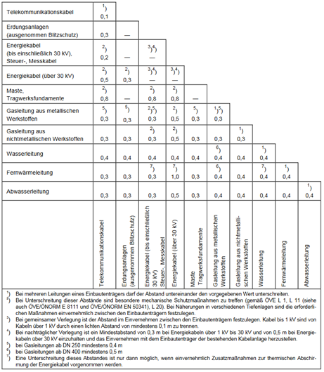
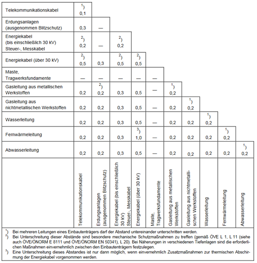

!!! abstract

    Die dargestellten Ergebnisse beziehen sich aus Erkenntnisse, die im Rahmen der Projektes NWB 4.0 vom Institut für Siedlungswasserwirtschaft der TU Graz erarbeitet wurden.

    Ansprechpartner: [Institut für Siedlungswasserwirtschaft](https:\\sww.tugraz.at)  
    Zuletzt aktualisiert: Dezember 2022

Die Planung und Umsetzung von Baumrigolen, Mulden und Versickerungsanlagen erfordert die Berücksichtigung einer Vielzahl technischer Regelwerke und Normen. Diese enthalten Anforderungen an den Untergrund, die Wasserqualität, den Schutz von Grundwasser und Vegetation, die Auswahl geeigneter Substrate sowie den Umgang mit standortspezifischen Belastungen wie Streusalzeinträgen.

Die nachfolgende Übersicht fasst die für dNWB-Systeme relevanten Regelwerke thematisch zusammen und beschreibt deren Bezug zu den jeweiligen Planungsaspekten. Sie dient als Orientierungshilfe für die Auswahl und Anwendung der einschlägigen Normen und Richtlinien im Rahmen der Planung, Bemessung, Ausführung und des Betriebs von Anlagen zur naturnahen Regenwasserbewirtschaftung.

## Anforderung an Abstände im Untergrund

### Grundwasserschutz

| Regelwerk | Relevanz für Abstände im Untergrund |
|------------|-------------------------------------|
| ÖNORM B 2506-1 – Regenwasser-Sickeranlagen für Abläufe von Dachflächen und befestigten Flächen | Anforderungen an den vertikalen Abstand zwischen Versickerungsanlage und maßgeblichem Grundwasserspiegel. |
| ÖWAV Regelblatt 45 – Oberflächenentwässerung durch Versickerung in den Untergrund | Konkretisiert Sicherheitsabstände zum Grundwasser und hydrogeologische Randbedingungen für Versickerungsanlagen. |
| DWA-A 138-1 – Anlagen zur Versickerung von Niederschlagswasser | Definiert Mindestabstände zum Grundwasser sowie Anforderungen an den Sickerraum und die Bodenzone. |

### Schutz von Bauwerken und Grundstücken

| Regelwerk | Relevanz für Abstände im Untergrund |
|------------|-------------------------------------|
| ÖNORM B 2506-1 – Regenwasser-Sickeranlagen für Abläufe von Dachflächen und befestigten Flächen | Enthält Anforderungen an die Lage von Versickerungsanlagen in Bezug auf Bauwerke und Grundstücksgrenzen. |
| ÖNORM B 2533 – Regenwasserbewirtschaftung für Dachflächen, befestigte und begrünte Flächen | Berücksichtigt Abstände zu Gebäuden, Nachbargrundstücken und bestehender Infrastruktur im Rahmen der Planung von Maßnahmen zur Regenwasserbewirtschaftung. |
| DWA-A 138-1 – Anlagen zur Versickerung von Niederschlagswasser | Enthält Empfehlungen zu Abständen von Versickerungsanlagen gegenüber Gebäuden, Böschungen und Grundstücksgrenzen. |

### Schutz von Bäumen und Wurzelräumen

| Regelwerk | Relevanz für Abstände im Untergrund |
|------------|-------------------------------------|
| ÖNORM B 1121 – Schutz von Gehölzen und Vegetationsflächen bei Baumaßnahmen | Definiert Schutzbereiche und Mindestabstände zu Wurzelräumen bei Bau- und Infrastrukturmaßnahmen. |
| DWA-M 162 – Bäume, unterirdische Leitungen und Kanäle | Enthält Empfehlungen zu Abständen zwischen Bäumen, Wurzeln, Kanälen, Leitungen und Versickerungsanlagen. |

### Verkehrsanlagen und Straßenentwässerung

| Regelwerk | Relevanz für Abstände im Untergrund |
|------------|-------------------------------------|
| RVS 03.04.11 – Entwässerung und Behandlung von Straßenwässern | Regelt Abstände und Standortanforderungen zum Schutz von Grundwasser, Bauwerken und sensiblen Untergrundbereichen bei der Straßenentwässerung. |

## Anforderungen an die Wasserqualität

### Schutz des Grundwassers

| Regelwerk | Relevanz für die Wasserqualität |
|------------|--------------------------------|
| ÖNORM B 2506-1 – Regenwasser-Sickeranlagen für Abläufe von Dachflächen und befestigten Flächen | Enthält Anforderungen an die Eignung von Niederschlagswasser zur Versickerung sowie an den Schutz des Grundwassers vor Schadstoffeinträgen. |
| ÖNORM B 2506-2 – Regenwasser-Sickeranlagen für Abläufe von Dachflächen und befestigten Flächen – Anforderungen an die Wasserbeschaffenheit | Legt Anforderungen an die Qualität des zu versickernden Niederschlagswassers fest und definiert Einsatzgrenzen für unterschiedliche Versickerungssysteme. |
| ÖWAV Regelblatt 9 – Hinweise für die Anwendung der Qualitätszielverordnung Chemie Grundwasser | Unterstützt die Beurteilung von Stoffeinträgen hinsichtlich der Einhaltung von Grundwasserqualitätszielen. |
| ÖWAV Regelblatt 45 – Oberflächenentwässerung durch Versickerung in den Untergrund | Beschreibt die Bewertung der Niederschlagswasserqualität und notwendige Vorbehandlungsmaßnahmen vor einer Versickerung. |
| DWA-A 138-1 – Anlagen zur Versickerung von Niederschlagswasser – Teil 1: Planung, Bau, Betrieb | Definiert Anforderungen an die Wasserbeschaffenheit und erforderliche Reinigungs- bzw. Vorbehandlungsmaßnahmen zum Schutz des Grundwassers. |

### Schutz von Oberflächengewässern

| Regelwerk | Relevanz für die Wasserqualität |
|------------|--------------------------------|
| ÖNORM EN 752 – Entwässerungssysteme außerhalb von Gebäuden | Definiert allgemeine Anforderungen zum Schutz von Gewässern vor stofflichen Belastungen aus Entwässerungssystemen. |
| ÖWAV Regelblatt 35 – Einleitung von Niederschlagswasser in Oberflächengewässer | Enthält Anforderungen zur Bewertung und Begrenzung von Stoffeinträgen aus Niederschlagswasser in Gewässer. |
| ÖWAV Regelblatt 407 – Nachhaltige Regenwasserbewirtschaftung | Behandelt Maßnahmen zur Minimierung von Stofffrachten und zur Verbesserung der Gewässerverträglichkeit von Niederschlagswasserabflüssen. |
| RVS 04.04.11 – Gewässerschutz an Straßen | Regelt die Behandlung und Rückhaltung von Schadstoffen aus Straßenabflüssen zum Schutz von Oberflächengewässern und Grundwasser. |

### Anforderungen an Substrate und Vegetation

| Regelwerk | Relevanz für die Wasserqualität |
|------------|--------------------------------|
| ÖNORM B 1121 – Schutz von Gehölzen und Vegetationsflächen bei Baumaßnahmen | Berücksichtigt die Auswirkungen belasteter Wässer auf Vegetationsflächen und Wurzelräume. |
| ÖNORM L 1210 – Begrünungen auf Dächern und Decken | Enthält Anforderungen an Substrate und Materialien zur Vermeidung unerwünschter Stoffausträge aus Dachbegrünungen. |

### Betrieb, Wartung und langfristige Reinigungsleistung

| Regelwerk | Relevanz für die Wasserqualität |
|------------|--------------------------------|
| ÖNORM B 2506-3 – Regenwasser-Sickeranlagen für Abläufe von Dachflächen und befestigten Flächen – Betrieb und Wartung | Beschreibt Inspektions-, Wartungs- und Kontrollmaßnahmen zur Sicherstellung einer dauerhaft wirksamen Reinigungsleistung. |
| ÖWAV Regelblatt 407 – Nachhaltige Regenwasserbewirtschaftung | Enthält Empfehlungen zur langfristigen Sicherstellung der Behandlungs- und Reinigungswirkung von Anlagen zur Regenwasserbewirtschaftung. |

## Anforderungen an Substrate/Bodenmaterial

| Regelwerk | Relevanz für Substrate und Bodenmaterial |
|------------|-----------------------------------------|
| ÖNORM B 2506-1 – Regenwasser-Sickeranlagen für Abläufe von Dachflächen und befestigten Flächen | Enthält Anforderungen an die Durchlässigkeit und Eignung des anstehenden Bodens sowie an den Aufbau von Filter- und Versickerungsschichten. |
| ÖNORM L 1210 – Begrünungen auf Dächern und Decken | Definiert Anforderungen an Zusammensetzung, physikalische Eigenschaften und Qualitätskriterien von Substraten für Dachbegrünungen. |
| ÖNORM L 1111 – Boden aus dem Landschaftsbau – Anforderungen an Bodenmaterialien | Legt Anforderungen an Oberboden, Unterboden und aufbereitete Bodenmaterialien hinsichtlich Bodenaufbau, Schadstoffgehalt und Verwendungseignung fest. |
| FLL-Empfehlungen für Baumpflanzungen – Empfehlungen für Baumpflanzungen, Teil 2: Standortvorbereitungen für Neupflanzungen; Pflanzgruben und Wurzelraumgestaltung | Beschreibt Anforderungen an Baumsubstrate, Wurzelraumvolumen, Tragfähigkeit, Wasserhaushalt und Durchwurzelbarkeit von Standorten für Straßen- und Stadtbäume. |

## Anforderungen an den Wurzelschutz

| Regelwerk | Relevanz für den Wurzelschutz |
|------------|-----------------------------|
| ÖNORM L 1122 – Baumschutz bei Baumaßnahmen | Definiert Schutzmaßnahmen für Bäume während der Bauphase und legt Anforderungen an den Schutz von Stamm, Krone und insbesondere Wurzelraum fest. |
| ÖNORM B 1121 – Schutz von Gehölzen und Vegetationsflächen bei Baumaßnahmen | Beschreibt Schutzbereiche, zulässige Eingriffe sowie Maßnahmen zur Vermeidung von Schäden an Wurzeln, Gehölzen und Vegetationsflächen während Bauarbeiten. |
| DWA-M 162 – Bäume, unterirdische Leitungen und Kanäle | Behandelt die Wechselwirkungen zwischen Wurzeln und unterirdischer Infrastruktur und gibt Empfehlungen zu Planung, Schutzmaßnahmen und Konfliktvermeidung zwischen Wurzelraum, Leitungen und Kanälen. |

## Anforderungen an den Streumitteleinsatz

| Regelwerk | Relevanz für den Streumitteleinsatz |
|------------|-----------------------------------|
| RVS 12.04.15 – Minimierung von Umweltauswirkungen beim Einsatz von Streumitteln im Winterdienst | Enthält Empfehlungen zur Reduktion der Umweltbelastung durch Auftau- und Abstumpfungsmittel. Behandelt insbesondere Auswirkungen auf Boden, Vegetation, Oberflächengewässer und Grundwasser. :contentReference[oaicite:0]{index=0} |
| RVS Arbeitspapier Nr. 11 – Einsatz von Streumitteln im Winterdienst | Ergänzt die RVS 12.04.15 um fachliche Grundlagen und Anwendungshinweise zum sachgerechten Einsatz verschiedener Streumittel sowie zur Optimierung von Streumengen und Streustrategien. :contentReference[oaicite:1]{index=1} |
| RVS 12.04.12 – Schneeräumung und Streuung | Legt die Grundsätze und Mindeststandards für die Durchführung des Winterdienstes fest. Enthält Vorgaben zur Auswahl und Anwendung von Streumitteln in Abhängigkeit von Straßentyp, Verkehrsaufkommen und Verkehrssicherheitsanforderungen. :contentReference[oaicite:2]{index=2} |

## Spezielle Empfehlungen zu Baumstandorten

### Abstände zwischen Versickerungsanlagen und Grundwasserspiegel

Versickerungsanalagen müssen so angeordnet werden, sodass das
Grundwasser nicht durch das versickernde Wasser beeinträchtigt wird. Der
Abstand vom tiefsten Punkt der Versickerungsanlage zum maßgeblich
höchsten Punkt des Grundwasserspiegels, ist von den
Grundwasserschutzanforderungen und der Sickergeschwindigkeit abhängig.
Mindestens 1 m natürlich gewachsener Boden muss dazwischenliegen. (ON, 2013)

Laut DWA-A 138-1 (DWA, 2020) soll der Abstand von der Sohle der
Versickerungsanlage zum mittleren höchsten Grundwasserstand mindestens
1 m betragen.

### Abstände zwischen Versickerungsanlagen und Gebäuden

Bei Versickerungsanlagen ist darauf zu achten, dass Fundamente, Keller,
Leitungskanäle,\... nicht durchfeuchtet werden, ein ausreichender
Sicherheitsabstand zur Vermeidung von Vernässung ist notwendig. Bei der
Abstandsbemesseung sind folgende Parameter zu berücksichtigen (ON,
2013):

- Bodendurchlässigkeit

- Schichtung und --neigung des Untergrundes

- Bauausführung des Gebäudes und Fundamenttiefe

- Grundwasser-Flurabstand und --gefälle

- Tiefe der Sickerleitung

Es dürfen keine Schäden an Gebäuden und Anlagen durch
Versickerungsanlagen entstehen. Der Abstand von einem Gebäude zu einer
Versickerungsanlage ist als unkritisch zu betrachten, wenn das Gebäude
mit wasserdruckhaltender Abdichtung versehen ist und bautechnische
Grundsätze wie z.B. Lastabtragsbereiche berücksichtigt werden. Wurde das
Gebäude bzw. der Keller nicht wasserdicht ausgeführt, dann sollte der
Abstand vom Baugrubenfußpunkt der Versickerungsanlage mindestens das
1,5 fache der Baugrubentiefe betragen. Zusätzlich ist ein Abstand von
mindestens 0,5 m von der Versickerungsanlage zur Böschungsoberkante
einzuhalten. (DWA, 2020)

### Abstände zwischen unterirdischen Leitungen und Gehölzen

Für Baumpflanzungen gilt, dort wo unterirdische Leitungen vorhanden sind
oder geplant werden, sollten keine Bäume gepflanzt werden. Lässt sich
dies nicht vermeiden, so sind technische Schutzmaßnahmen vorzunehmen und
Mindestabstände einzuhalten. (ON, 2004)

### Abstände unterirdischer Einbauten Verkehrsraum

Tabelle 2‑1 und Tabelle 2‑2 zeigen die empfohlenen Mindestabstände der
ÖNORM B 2533 (ON, 2004) zu den Einbauten zueinander.

Tabelle 2‑1: Horizontale lichte Mindestabstände (in m) bei
Parallelführung ÖNORM B 2533 (ON, 2004)

Tabelle 2‑2: Vertikale lichte Mindestabstände (in m) bei Querungen ÖNORM
B 2533 (ON, 2004)

#### Anforderungen an die Wasserqualität - Grundwasser

Besteht eine stoffliche Belastung für das Grundwasser, so ist die
Bewilligungspflicht nach WRG 1959 und die Einhaltung der
Qualitätszielverordnung Chemie Grundwasser zu berücksichtigen (ÖWAV,
2015).

#### Anforderung an die Wasserqualität - Versickerungsanalagen

Das ÖWAV Regelblatt 45 teilt Herkunftsflächen von Niederschlagswasser in
fünf Kategorien ein, für die ein steigender Verschmutzungsgrad
angenommen wird und steigende Anforderungen an die Reinigung vor der
Versickerung angesetzt werden. Die Kategorisierung kann Tabelle 2‑3
entnommen werden:

Tabelle 2‑3: Herkunftsflächenkategorisierung nach ÖWAV Regelblatt 45
(ÖWAV, 2015)

| Kategorie | Dachflächen | Ruhender Verkehr | Straßen | Gleisanlagen | Gewerke und Industrie |
| --- | --- | --- | --- | --- | --- |
| F1 | Gering verschmutzte Glas-, Grün-, Kies- und Tondächer;Dachflächen< 200 m² | - | Radwege,Gehwege | - | Nicht befahrene Vorplätze, Zufahrten für Einsatzwägen |
| F2 | Gering verschmutzte Dachflächen, die nicht unter F1 fallen | < 20 KFZ / 400 m²;< 75 KFZ / 2000 m² bei geringem FZwechsel | < 500 DTV | < 5000 BTO, ohne freie Strecke | - |
| F3 | - | 20 - 75 KFZ / 400 - 2000 m² mit häufigem Fahrzeugwechsel;> 75 KFZ / 2000 m² mit geringem FZwechsel | 500 - 15000 DTV | > 5000 BTO ohne freie Strecke | Vor Emissionen geschützte LKW-Stellplätze und Umschlagplätze |
| F4 | - | > 1000 KFZ / 400 m² | > 15000 DTV – i.d.R. Zweispurige Straßen | - | Betriebliche Fahrflächen, Flächen mit starker Verschmutzung |
| F5 | Stark verschmutzte Dachflächen (in Industriegebieten) | Nicht geschützte LKW-Stellplätze | - | - | Stark verschmutzte Betriebsflächen |

Für jede Flächenkategorie wird im ÖWAV Regelblatt 45 festgelegt, wie es
vor der Versickerung vorbehandelt werden muss. Die Regelung kann in
Tabelle 2‑4 entnommen werden.

Tabelle 2‑4: Empfohlene Versickerungsanlagen nach
Herkunftsflächenkategorie nach ÖWAV 45 (ÖWAV, 2015)

|                              | Systeme mit mineralischem Filter | Systeme mit mineralischem Filter | Systeme mit Rasen | Systeme mit Rasen | Systeme mit Rasen | Systeme mit Bodenfilter | Systeme mit Bodenfilter | Systeme mit technischem Filter | Systeme mit technischem Filter | Systeme mit technischem Filter |
|------------------------------| --- | --- | --- | --- | --- | --- | --- | --- | --- | --- |
| Flächentyp gemäß Tabelle 2‑3 | Sickerschacht | Unterirdischer Sickerkörper (Rigolenversickerung) | Rasenfläche | Rasenmulde | Rasenbecken | Bodenfilter in Mulden-/ Rinnenform | Bodenfilter in Beckenform | Sickerschacht mit technischem Filter | Technischer Filter in Mulde- / Rinnenform | Technischer Filter in Beckenform |
| F1                           | M | M | X | X | X | X | X | X | X | X |
| F2                           | - | - | X | X | X | X | X | M | X | X |
| F3                           | - | - | M | - | - | X | X | i.B. | M | M |
| F4                           | - | - | - | - | - | X | X | i.B. | M | M |
| F5                           | - | - | - | - | - | i.B. | i.B. | i.B. | i.B. | i.B. |

X: Empfohlen; M: Zulässig; i.B.: Zulässig nach individueller Beurteilung; -: Nicht zulässig

Die im Stockholmsystemen zum Einsatz kommende Schwammstadt fällt (ohne
Nachweis einer weitergehenden Wirkung) als Rigolenversickerung unter
„Systeme mit mineralischem Filter". Daraus lässt sich ableiten, dass
eine direkte Einleitung in das Schwammstadtsubstrat ohne Vorbehandlung
nur für Flächen der Kategorie F1 zulässig sind. Dies ist der Fall für
gering verschmutzte Dachflächen einiger Materialen, Dachflächen aller
Typen kleiner als 200 m² oder Geh- und Radwege.

Um Niederschlagswasser von stärker verschmutzten Flächen, wie zum
Beispiel Stadtstraßen \< 15000 DTV, versickern zu dürfen, sind Systeme
mit Bodenfilter am besten geeignet. Anforderungen an Bodenfilter sind in
der ÖNORM B 2506-2 erläutert.

Sollen Parkflächen der Kategorien F2 direkt über eine durchlässige
Oberfläche versickert werden, ist eine Versickerung über eine
Rasenfläche oder über eine mit durchlässig gestaltete Oberfläche mit
Oberbodenschicht zulässig.

Für die Versickerung durch eine bewachsene Bodenzone werden im Entwurf
des DWA-Arbeitsblatt 138-1 (DWA, 2020) in Abhängigkeit der
Herkunftsfläche Vorgaben hinsichtlich des Verhältnisses der
angeschlossenen zur versickernden Fläche gemacht. Die Herkunftsflächen
werden in der DWA anders kategorisiert als im ÖWAV Regelblatt 45.

#### Anforderungen an die Wasserqualität - Oberflächengewässer

Sollte die Situation erfordern, dass es zu einer Einleitung in einen
Niederschlagswasserkanal kommt, dann ist auch hier die
Bewilligungspflicht nach WRG 1959 und die Einhaltung der
Qualitätszielverordnung Chemie Oberflächengewässer zu berücksichtigen
(ÖWAV, 2019).

#### Anforderungen an Substrate/Bodenmaterial

Laut ÖNORM B 2506-1 (ON, 2013) sind Sickermulden mit mind. 30 cm
belebter Bodenzone, einer Sickergeschwindigkeit zwischen 0,6 -- 6,0
l/(min\*m2) und einem Durchlässigkeitswert zwischen 10-5 -- 10-4 m/s
auszuführen. Bei Anlagen ohne Speichervolumen ist ein
Durchlässigkeitswert von mind. 10-5 m/s einzuhalten.

Weiters muss das Bodenamterial/Substrat folgende chemische --
physikalische Parameter entsprechen (ON, 2007):

- Gehalt von organsicher Substanz im Oberboden: \> 1 %, Obergrenze: 15 %
  je nach geplanten Pflanzenbewuchs

- Gehalt von organsicher Substanz im Unterboden (ab 40 cm Tiefe): \< 1 %

- C/N-Verhältnis: zwischen 10 und 15

- pH Wert: 5,5 - 7,5 (bei Moorbeetpflanzen 4,0 -- 5,0)

- Austauschkomplex muss mindestens zu 80 % mit Ca, 5 % Mg, 2 % K und
  weniger als 1 % Na belegt sein (Ausnahme Moorbeetpflanzen)

- Spezifische elektrische Leitfähigkeit im Oberboden: max. 30 mS \*
  m$^{-1}$

- Spezifische elektrische Leitfähigkeit im Unterboden: max. 10 mS \*
  m$^{-1}$

- Durchlässigkeitsbeiwert im Oberboden: mind. 0,2 m \* d$^{-1}$

- Durchlässigkeitsbeiwert im Unterboden: mind. 0,05 m \* d$^{-1}$

- Nutzbare Feldkapazität (Wasserspeichervermögen): mind. 60 l \* m$^{-2}$
  (Ausnahme Sonderkulturen wie Magerrasen)

Durchwurzelbare Substrate finden in Anwendung als Schwammstadtsubstrat
oder auch als Baumsubstrat. Einzuhaltende Parameter nach ÖNORM L1111
werden in Tabelle 2‑5 aufgelistet.

Tabelle 2‑5: Anforderungen an durchwurzelbare Unterbauten nach ÖNORM L
1111

 | Parameter                                                    | Wert              | Einheit |
|--------------------------------------------------------------|-------------------| --- |
| Wasserdurchlässigkeit                                        | ≥ 5,0 * 10$^{-6}$ | m/s |
| Luftkapazität (pF 1,8)                                       | ≥ 15              | % |
| pH-Wert (Feinsubstrat)                                       | 5,5 - 8,5         | - |
| Pflanzenvergügbare Wasserspeicherfähigkeit (pF 1,8 – pF 4,2) | ≥ 10              | % |
| Organisches Material                                         | ≤ 6               | Masse-% |
| -> Davon nicht abbaubar                                      | ≥ 50              | % |
| Spezifische Leitfähigkeit                                    | 30                | mS/m |

#### Anforderungen an Wurzelschutz

Der Bodenaushub hat in wurzelschonender Bauweise zu erfolgen. Wurden
Wurzeln von mehr als 3 cm dicke freigelegt, so dürfen diese nicht
abgeschnitten werden, sondern müssen vor Austrocknung und Frost
geschützt werden. Auswirkungen von Wurzelkappungen bzw.
Wurzelbeschädigungen können Schwundrisse, in die Pilze eindringen,
Kallus, Adventivwurzeln, endständiger Wurzelteil, Fäule,... sein. Auch
die Schutzbereiche müssen eingehalten werden, bei Bäumen beträgt der
Schutzbereich die Kronentraufe plus 1,5 m breiter Streifen, bei
säulenförmigen Bäumen die Kronentraufe plus 5 m breiter Streifen und bei
einer Hecke die überschirmte Fläche plus 1,5 m breiter Streifen. (ON, 2021)

#### Anforderungen an Streumitteleinsatz - Auswirkungen auf Gewässer

Durch die Anwendung von Streusplitt sind im Allgemeinen keine relevanten
Umweltauswirkungen auf Boden, Pflanzen oder Wasser gegeben. Es ist aber
bei Streumittel darauf zu achten, dass die natürliche
Schwermetallbelastung des Ausgangsgesteins gering ist. Auf Grund des
hohen Gehalts an Cadmium und Nickel ist Serpentinit ungeeignet. (RVS, 2012)

Bei der Auswirkung durch Streusalz auf Gewässer müssen die Grenzwerte
der Chloridbelastung der Trinkwasserverordnung bzw. die QZV Chemie
Grundwasser/Oberflächengewässer berücksichtigt werden.

#### Anforderungen an Streumitteleinsatz - Auswirkungen auf Vegetation

Durch die Anwendung von Streusplitt sind im Allgemeinen keine relevanten
Umweltauswirkungen auf Boden, Pflanzen oder Wasser gegeben. Es ist aber
bei Streumittel darauf zu achten, dass die natürliche
Schwermetallbelastung des Ausgangsgesteins gering ist. Auf Grund des
hohen Gehalts an Cadmium und Nickel ist Serpentinit ungeeignet. (RVS, 2012)

Bei der Verwendung von Streusalz, kann es zu Störungen des biologischen,
chemischen und physikalischen Bodenhaushalts kommen. Dabei können
Schäden an der Bodenflora oder Mykorrhizaschäden, Verschlämmung oder
Verdichtung durch Veränderung der physikalischen Bodeneigenschaften oder
z.B.: Salz-Akkumulation durch Veränderung der chemischen
Bodeneigenschaften kommen. (RVS, 2012)

Auswirkungen durch Streusalz auf Pflanzen können durch Spritzwasser
(Salzablagerung auf der Blattoberfläche) oder Aufnahme über das Boden-
bzw. Grundwasser entstehen. Kontaktschäden, Osmotische Wirkung,
Nekrosen, Blattverlust oder Nährstoffungleichgewicht sind mögliche
Auswirkungen von Streusalz. Durch Störungen des biologischen, chemischen
und physikalischen Bodenhaushalts können indirekte Auswirkungen auf
Pflanzen entstehen. Ca. 90 % der Schäden sind auf den Eintragspfad
Boden- bzw. Grundwasser und 10 % auf Spritzwasser zurückzuführen. (RVS, 2012)

Die Chlorid-Dosis, die die Pflanzen aufnehmen, hängt von der
Verweildauer der mit Chlorid belasteten Wässer im Wurzelraum und der
Chlorid-Konzentration im Boden bzw.: Grundwasser ab. Für den
Vegetationsschutz können die Grenzwerte der Trinkwasserverordnung nicht
herangezogen werden, da diese sich an der Geschmacksgrenze orientiert.
Einen Grenzwert für Chlorid im Grundwasser als Vegetationsschutz gibt es
nicht. Nach ÖWAV Arbeitsbehelf 11 (ÖWAV, 2003) ist nur ein Chloridgehalt
bis 70 mg/l im Bewässerungswasser für fast alle Pflanzen geeignet. Für
chloridverträgliche Pflanzen ist auch ein Chloridgehalt zwischen 70 und
140 mg/l im Bewässerungswasser geeignet. (RVS, 2012)

#### Anforderungen an Streumitteleinsatz - Auswirkungen auf Straßenraum

Sowohl abstumpfende als auch auftauende Streumittel bringen Probleme mit
sich, Bauwerksschäden durch Sulfat oder Korrision von Fahrzeugen (RVS,
2022).
